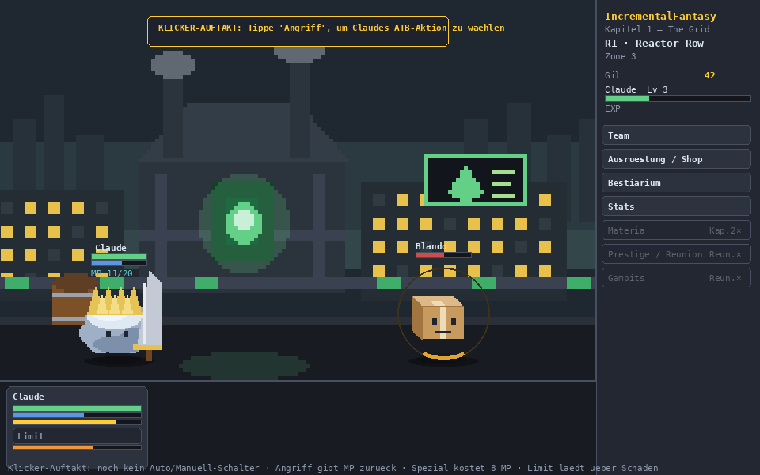
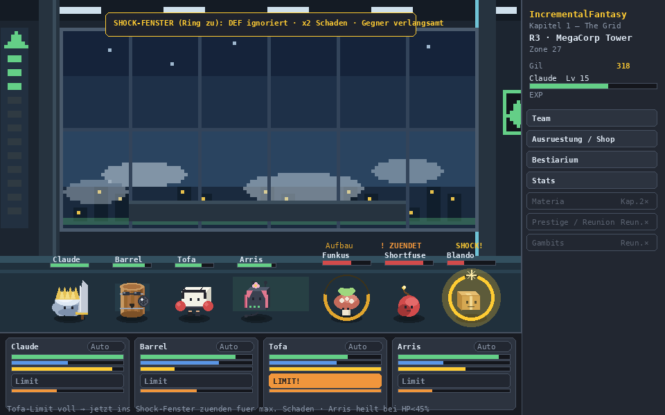
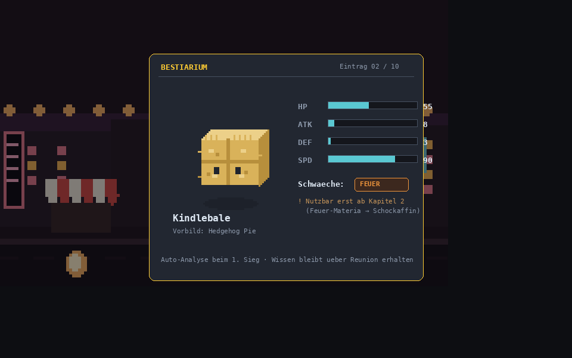
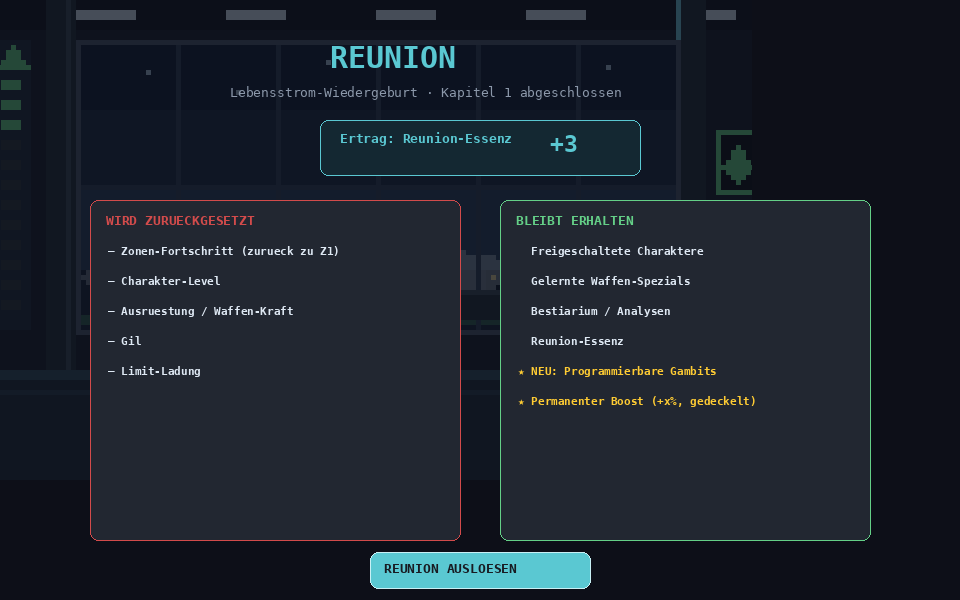
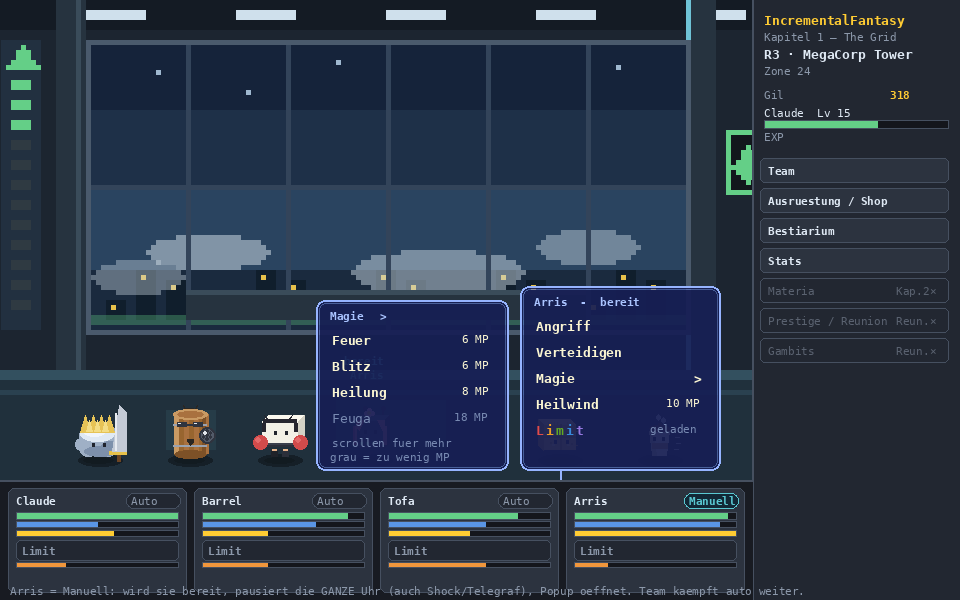
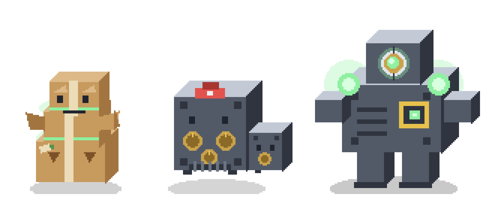

# Feinspec Kapitel 1 – „The Grid" (Zyklus 1, bis zur 1. Reunion)

**Status:** Implementierungsnahe Feinspec. Alle Zahlen sind eine **simulationsvalidierte Playtest-Baseline** (kein finaler Balance-Stand) – siehe §11. Formeln, Datenmodelle und der Tick-Loop sind so gehalten, dass ein Prototyp direkt daraus gebaut werden kann.
**Rahmen:** `../03_Konzept_Gerüst.md` (Anker) + die betroffenen `spec/*.md` (siehe Schnittstellen).
**Prüfinstanz:** `../02_Leitfaden_Kernmechaniken.md`. Leitplanken-Check in §10.
**Validierung:** Kampf-/Pacing-Simulator `assets/sim/sim_chapter1.py` (deterministisch, ATB-getaktet). Alle Pacing-Zahlen in §8 stammen aus einem Durchlauf dieses Simulators.

## Schnittstellen zu anderen Systemen

- **Kampf/Shock** (`kampf-analyse-shock.md`): ATB-Takt, MP-Kanäle, Shock-Fenster, Limit, Analyse.
- **Stats** (`stats-kampfwerte.md`): Kern-Stats, Schadens-/ATB-Formel, Level-Wachstum.
- **Progression** (`progression-regionen.md`): 3 Regionen, Roster-Rhythmus, Gate-Struktur.
- **Encounter** (`encounter-zyklus1.md`): Monster-Platzierung Z1–Z30, Skalierung `g`.
- **Gegner** (`gegner-katalog.md`): 7 in Zyklus 1 aktive Monster + 3 Gates.
- **Ausrüstung/Gil** (`ausruestung-gil.md`): Waffe = Stats + Special-Freischaltung (Slots erst Kap. 2).
- **Ökonomie** (`oekonomie-waehrungen.md`): aktiv nur EXP + Gil (+ MP als Kampf-Ressource).
- **Niederlage/Offline** (`niederlage-offline.md`): Zeitstrafe, Retry, Offline-Ernte.
- **Prestige** (`prestige-reunion.md`): 1. Reunion = Reset/Persistenz + Gambit-Freischaltung.
- **UI** (`ui-layout.md`): Stage/Bottom/Sidebar-Budget; hier als konkrete Screens umgesetzt.

---

## 0. Geltungsbereich: Was Kapitel 1 enthält – und was bewusst nicht

**Enthalten (der komplette erste Spielabschnitt):** Kern-Loop (Auto-Battle → EXP/Gil), ATB, manueller Klicker-Auftakt, Auto-Attack-Regel, Waffen-Specials der 4 Figuren, Limit als Wand-Brecher, MP als Limiter (2 von 3 Regen-Kanälen), Analyse/Bestiarium, Shock (neutral, langsam), Ausrüstungskauf über Gil, Niederlage/Retry, Offline-Ernte, die 1. Reunion.

**Bewusst NICHT enthalten** (öffnet ab Kapitel 2 / 1. Reunion, vgl. `progression-regionen.md` §2):
Materia & Slots, Magie/Zauber, AP-Ökonomie, Materia-Prestige, der **programmierbare** Gambit-Editor (in Kap. 1 laufen nur die fest verdrahteten Default-Regeln aus §4.7), Element-Schwächen als **nutzbare** Mechanik (Kindlebales Feuer-Schwäche ist reiner Teaser), Resistenzen, Summons. Der dritte MP-Kanal (Zeit-Trickle) ist in Kap. 1 noch inaktiv.

---

## 1. Systemüberblick in vier Screens

Die folgenden Mockups sind aus den vorhandenen Pixel-Assets (`assets/characters`, `assets/monsters`, `assets/regions`) komponiert und zeigen das Zielbild. Reproduzierbar über `assets/sim/make_mockups.py`. Layout-Budget nach `ui-layout.md`: Stage ~78 %, Bottom-Leiste ~20 %, Seitenleiste ~22 %.

### 1.1 Region 1 – Klicker-Auftakt (Claude solo)



Der Einstieg: nur **Claude** gegen einen einzelnen **Blando** vor der Reactor-Row-Kulisse. Der Spieler wählt anfangs jede ATB-Aktion selbst (Banner oben). MP ist gerade sichtbar geworden (erster Waffen-Special). Unten Claudes Panel mit HP/MP/ATB und der ladenden **Limit**-Leiste. Modus „MANUELL".

### 1.2 Region 3 – Volle Party & Shock-Fenster



Der Kampf in seiner vollen Kapitel-1-Form: alle vier Figuren, drei Gegner. Ein **Blando ist geschockt** – **voller goldener Ring + Bruch-Symbol** (DEF ignoriert, ×2 Schaden, verlangsamt); der **Funkus** daneben zeigt seinen **Shock-Aufbau** als von unten gefüllten Ring. **Shortfuse** telegrafiert seine Selbstzerstörung („! ZUENDET"). **Tofas Limit ist voll** (leuchtet orange) – der aktive Spieler zündet es jetzt ins Shock-Fenster. Modus „AUTO" (Default-Regeln laufen selbst). Shock-Ring-Farbe & -Symbolik: `kampf-analyse-shock.md` §6.

### 1.3 Analyse & Bestiarium



Beim ersten Sieg über eine Art wird sie automatisch analysiert. Die Karte zeigt Grundstats (HP/ATK/DEF/SPD) und eine sichtbare **Schwäche** – hier Kindlebales Feuer, explizit markiert als **erst ab Kapitel 2 nutzbar** (Köder). Wissen bleibt über Reunion erhalten.

### 1.4 Die 1. Reunion



Am Kapitelende: die klaren **Reset-** vs. **Persistenz-Listen** und der Ertrag in **Reunion-Essenz**. Die 1. Reunion ist der Sonderfall, der zusätzlich die **programmierbaren Gambits** und einen ersten permanenten Boost freischaltet.

### 1.5 Manuelle Steuerung – Aktions-Popup



Die manuelle Steuerung als **FF7-Menübox** am Charakter-Panel: dunkle Blau/Lila-Box, helle Schrift. **Arris** steht auf **Manuell** (cyan Chip), das übrige Team auf **Auto** – wird Arris bereit, pausiert die gesamte Uhr und ihr Popup öffnet. **Grundaktionen** (Angriff, Verteidigen, Spezial „Heilwind") stehen fix; **Limit** erscheint in **bunten Buchstaben**, wenn geladen; **nicht nutzbare Aktionen** bleiben sichtbar, aber **ausgegraut + dünn** (hier „Feuga – zu wenig MP"). Materia lebt unter der Kategorie **„Magie ▸"** als scroll-/blätterbare Unterliste – das Popup bleibt gleich groß, egal wie viele Zauber. Verhalten & Rollout: §5.1 sowie `gambits.md` / `ui-layout.md`. *(Hier im ausgebauten Zustand gezeigt; Verteidigen und die Magie-Kategorie erscheinen erst ab ihren Freischaltungen – in Kapitel 1 zunächst nur Angriff/Spezial/Limit.)*

---

## 2. Globale Konstanten (Playtest-Baseline)

| Konstante | Symbol | Wert | Quelle/Begründung |
|-----------|--------|------|-------------------|
| ATB-Basisintervall | `BASE_T` | **2,0 s** | `stats-kampfwerte.md`; SPD 100 = 1 Aktion / 2 s |
| Zonen-Wachstumsfaktor | `g` | **1,07** | glatt Zone-für-Zone; sim-justiert (Spec-Vorschlag war 1,08) |
| Tick-Auflösung | `DT` | 0,1 s | Simulations-/Loop-Takt |
| Shock-Schwelle | `SHOCK_MAX` | 100 | willkürliche Einheit |
| Shock-Fensterdauer | `SHOCK_WINDOW` | 6,0 s | im Spec-Band 5–8 s |
| Shock-Schadensmultiplikator | – | ×2,0 | im Fenster |
| Shock-Verlangsamung Gegner-ATB | – | ×0,3 | Gegner „stark verlangsamt" |
| Limit-Cap | `LIMIT_MAX` | 100 | persistiert über den Run, Reset bei Reunion |
| Zeitstrafe bei Niederlage | `RETRY_PENALTY` | 5,0 s | „milde Zeitstrafe" |
| MP-Refill nach Sieg (Kanal 1) | – | +25 % max. MP | prozentual (skaliert sauber) |
| MP-Refund pro Angriff (Kanal 3) | – | +2 MP flach | schließt den Attack-Refund-Loop |
| MP-Trickle über Zeit (Kanal 2) | – | **inaktiv** in Kap. 1 | öffnet später |
| Offline-Rate | – | 60 % der Aktiv-Rate | „etwas unter Aktiv", gedeckelt |
| Offline-Deckel | – | 8 h Ernte | „Welcome-back"-Fenster |

**Level-Wachstum pro Stufe** (multiplikativ auf den Basiswert): HP ×1,09 · ATK ×1,055 · MAG ×1,055 · DEF ×1,05 · SPD ×1,00 (SPD bleibt Build-Hebel). Dass ATK (5,5 %/Level) knapp unter `g` (7 %/Zone) liegt, ist Absicht: die Party fällt über eine Region minimal zurück → am Gate steht eine spürbare, grindbare Wand (Ventil-Prinzip bleibt: EXP fließt weiter).

**EXP für den nächsten Level:** `exp_to_next(L) = round(20 · 1,22^(L-1))`. Kalibriert auf ~1 Levelaufstieg pro Zone, damit die Kampfdauer über das Kapitel ungefähr konstant bleibt.

---

## 3. Kern-Formeln

Alle deterministisch – **kein RNG** (kein Crit, kein Miss/Dodge), gemäß `stats-kampfwerte.md` §2.

### 3.1 Schaden (Mitigations-Kurve)

```
schaden(ATK, DEF) = max(1, round( ATK² / (ATK + DEF) ))
```

Hohe DEF macht zäh, aber nie unverwundbar. Magie-Schaden analog aus MAG. **Im Shock-Fenster** wird DEF als 0 gesetzt **und** das Ergebnis ×2 genommen – der gezielte Konter gegen Panzer (Safeguard).

*Beispiel:* Claude L1 (ATK 14) gegen Blando (DEF 2): `196/16 = 12` pro Treffer → 4 Angriffe für 40 HP → mit `BASE_T` genau **8 s** (deckt sich mit der Plausibilisierung in `stats-kampfwerte.md`).

### 3.2 ATB-Takt

```
atb_intervall(SPD)   = BASE_T · 100 / SPD          # Sekunden bis zur nächsten Aktion
füllrate_pro_tick    = DT / atb_intervall(SPD)      # * Modifikatoren (Shock, Suppress)
```

Ein geschockter Gegner füllt mit ×0,3; ein unterdrückter (Barrel) mit ×0,5. SPD 100 → 2,0 s; SPD 130 (Tofa) → 1,54 s; SPD 180 (Caffiend) → 1,11 s.

### 3.3 Shock-Aufbau

```
bei Treffer (Gegner NICHT im Fenster):
    shock += schaden · 0,5 + shock_bonus        # Tofa-Special: shock_bonus = 45
    wenn shock >= 100:  fenster starten (6 s), shock = 0
```

Neutral (alle Kap.-1-Gegner) baut also nur über Schaden auf – langsam, aber real. Tofas Special ist der Beschleuniger, bis in Kap. 2 Element-Materia den „Schockaffin"-Zustand auslöst.

**Anzeige & Zeitkopplung:** Der Shock-Stand erscheint als **Ring um den Gegner** in **Gold/Bernstein** (Amber `#e0a52e` im Aufbau, Gold `#ffcc33` im aktiven Fenster) – nicht Lila. Der Ring **füllt sich von unten** (Nähe zum Schock), schließt sich bei 100 % mit einem **Bruch-/Funken-Symbol** und **leert sich im Fenster von oben** (verbleibende Zeit). Voller Detail-Steckbrief: `kampf-analyse-shock.md` §6. **Auf- und Abbau laufen ausschließlich bei laufender Kampfuhr** – die Bedenkzeit-Pause (§5) friert den Shock-Timer mit ein.

### 3.4 Limit-Ladung

```
zugefügter Schaden:  limit += schaden · 0,35
erlittener Schaden:  limit += schaden · 0,50   (AoE: · 0,40 je getroffener Figur)
Cap 100, persistiert über den Run; Reset erst bei Reunion.
Zünden (Kap. 1, generisch): schaden(4,5·ATK, DEF) mit DEF-Ignore auf das stärkste Ziel.
```

Aufsparen ist eine Entscheidung: an einer Wand aufgeladen ankommen. Aktives Timing ins Shock-Fenster holt spürbar mehr heraus.

### 3.5 MP (zwei aktive Kanäle in Kap. 1)

```
Kanal 1 – nach jedem Sieg:  mp += 0,25 · max_mp
Kanal 3 – pro Angriff:      mp += 2   (flach)
Special-Kosten: siehe §6.1. Reicht MP nicht, fällt die Regel auf Angriff zurück
(→ füllt MP wieder auf → „MP leer → Angriff → MP zurück → wieder Special").
```

### 3.6 EXP / Gil / Level

```
Sieg → jede beteiligte Figur erhält die Summe der Monster-EXP der Welle.
       Gil-Ertrag = Summe der Monster-Gil.
Level-Up sobald exp >= exp_to_next(L); Überschuss wird übertragen.
Monster-EXP/Gil skalieren mit g^(zone-1) wie die Stats (§3.7).
```

### 3.7 Zonen-Skalierung

```
effektiver Monster-Stat = basis · g^(zone_index - 1)     # g = 1,07
Zonen-Index läuft über das ganze Kapitel durch:
    Region 1 = Zonen 1–8, Region 2 = 9–18, Region 3 = 19–30.
Gate-Spike = die Gate-Basiswerte (§6.2) liegen bereits ~1,6–1,8× über der
letzten regulären Zone der Region.
Größen-/Farbvarianten streuen ±15 % (kleiner = schwächer/schneller).
```

### 3.8 Niederlage & Offline

```
Niederlage: +5 s Zeitstrafe, dann Auto-Retry derselben Zone (Gegner voll,
Party frisch), KEIN Währungs-/Zonen-Verlust. Da deterministisch, ist ein
zweiter Verlust ohne Stärkezuwachs sicher → das Signal „grinden/verbessern".
Offline: Party kämpft die aktuelle Zone weiter, Ertrag = 60 % Aktiv, Deckel 8 h;
an einer unschaffbaren Wand stockt Offline in der Retry-Schleife (keine Progression).
```

---

## 4. Datenmodelle / Schemas

Sprache-agnostisch (JSON-nah). Feldnamen sind Implementierungsvorschläge; **Code auf Englisch** (Projektregel).

### 4.1 Character (Laufzeit-Instanz)

```jsonc
{
  "id": "claude",
  "name": "Claude",
  "level": 1,
  "base": { "hp":110, "mp":20, "atk":14, "mag":6, "def":4, "spd":100 },
  "growth": { "hp":1.09, "atk":1.055, "mag":1.055, "def":1.05, "spd":1.00 },
  "special": { "id":"cross_slash", "mpCost":8, "unlockedFromZone":3 },
  "weaponTier": 0,          // 0..4, Gil-gekauft; wirkt auf Stats (§6.4)
  "controlMode": "auto",    // "auto" | "manual" – je Figur, ab Schalter-Freischaltung (§5.1)
  // Laufzeit:
  "hp":110, "mp":20, "atb":0.0, "limit":0.0,
  "exp":0
}
```

Abgeleitete Stats: `stat = round(base.stat · growth.stat^(level-1)) · weaponMod`. `weaponMod` s. §6.4.

### 4.2 Monster (Katalog-Eintrag)

```jsonc
{
  "id": "safeguard",
  "name": "Safeguard",
  "base": { "hp":75, "atk":9, "def":12, "spd":70 },
  "reward": { "exp":12, "gil":10 },
  "trait": "armor",         // Enum s.u.
  "weaknessTag": null,      // z.B. "fire" (Teaser, in Kap.1 nicht nutzbar)
  "shockAffinity": "neutral",
  "sprite": "monsters/safeguard_64.png"
}
```

**Trait-Enum (Kap. 1):** `baseline` · `fast` (Suppress-Ziel) · `armor` (hohe DEF, Konter Shock) · `fireweak` (Teaser) · `bomb` (Selbstzerstörung nach 3 Treffern, AoE, feuer-immun) · `poison` (DoT) · `drain` (MP-Drain + Flucht nach 4 Aktionen) · `boss` (telegrafierte AoE alle 3 Aktionen).

### 4.3 Encounter / Zone

```jsonc
{
  "zone": 21,
  "region": 3,
  "waves": [                       // hier 1 Welle; Zonen können mehrere haben
    [ {"monster":"shortfuse","size":1.0},
      {"monster":"blando","size":1.0},
      {"monster":"blando","size":1.0} ]
  ],
  "isGate": false
}
```

`size` moduliert Stats (±15 %) und wird auf `g^(zone-1)` aufgeschlagen. Vollständige Zonen-Tabelle in §6.3.

### 4.4 Weapon / Item (Kap. 1: Stats + Special, keine Slots)

```jsonc
{
  "ownerId": "claude",
  "tier": 2,                       // Gil-gekauft, 0..4
  "statMod": { "atk":1.20, "hp":1.10, "mag":1.20 },   // = 1 + 0.10*tier / 0.05*tier
  "unlocksSpecial": true,          // Special ist an die Waffe gekoppelt
  "slots": []                      // leer in Kap. 1; ab Kap. 2 Materia-Slots
}
```

### 4.5 Bestiarium-Eintrag

```jsonc
{ "monsterId":"kindlebale", "discovered":true, "weaknessRevealed":"fire",
  "weaknessUsable":false, "persistsThroughReunion":true }
```

### 4.6 SaveState (Kapitel-1-Umfang)

```jsonc
{
  "chapter": 1,
  "currentZone": 21,
  "party": [ /* Character-Instanzen */ ],
  "roster": ["claude","barrel"],          // freigeschaltet bis hier
  "currencies": { "exp": {...}, "gil": 3140, "reunionEssence": 0 },
  "bestiary": { /* Monster-ID -> Eintrag */ },
  "reunionCount": 0,
  "flags": { "autoAttackUnlocked":true, "mpVisible":true,
             "manualToggleUnlocked":true, "defenseUnlocked":false, "materiaUnlocked":false },
  "offline": { "lastSeen": 1732300000 }
}
```

Zahlen laufen über eine **BigNumber-/eigene Notation ab Tag 1** (`oekonomie-waehrungen.md` §3), auch wenn Kap.-1-Werte klein sind.

### 4.7 Gambit-Default-Regeln (fest verdrahtet, kein Editor in Kap. 1)

Die Auto-Battle IST bereits eine Prioritätsliste – der Spieler kann sie in Kap. 1 nur **nicht editieren** (das schaltet die 1. Reunion frei). Reihenfolge = erste zutreffende Regel gewinnt:

```
1. WENN ich = Arris  UND ein Verbündeter HP < 45%  UND MP >= 10   DANN Heilung
2. WENN ich = Tofa   UND Ziel nicht geschockt      UND MP >= 7    DANN Shock-Schlag
3. WENN ich = Barrel UND Gegner mit SPD >= 140 da  UND MP >= 6    DANN Suppress
4. WENN ich = Claude UND MP >= 8                                  DANN Special (stärkstes Ziel)
5. WENN Boss anwesend UND Limit voll                              DANN Limit
6. SONST                                                          Angriff (Fallback, +MP)
```

Zielwahl-Fallback: entschärfe zuerst `bomb`, dann `drain`, sonst schwächstes Ziel. **Steht `controlMode` einer Figur auf `manual`, werden diese Regeln für sie übersprungen** – der Spieler wählt im Aktions-Popup (globale Wait-Pause, s. §5.1).

---

## 5. Kampf-Tick-Loop (Referenz-Pseudocode)

Vollständig lauffähig umgesetzt in `assets/sim/sim_chapter1.py`. Kern:

```
function battleTick(state, DT):
    if state.awaitingPlayerChoice: return PAUSED   # Bedenkzeit-Pause (Wait-Modus):
        # Uhr steht -> KEIN ATB, KEIN Shock-Auf/-Abbau, keine Telegrafs/DoT-Ticks.
        # Nur bei Idle/Auto oder nach bestaetigter Wahl laeuft die Uhr weiter.
    if keine Gegner leben: return WIN
    if keine Party lebt:   return LOSS

    tickPoison(state, DT)                       # 1 Tick/s DoT

    for f in party + enemies (in fester Reihenfolge):
        if not f.alive: continue
        rate = 1.0
        if f.isEnemy and f.shockTimer > 0: rate *= 0.3
        if f.suppress > 0: rate *= 0.5 ; f.suppress -= DT
        if f.isEnemy and f.shockTimer > 0: f.shockTimer -= DT
        f.atb += DT / atb_intervall(f.spd) * rate

        if f.atb >= 1.0:
            if f.isParty and f.controlMode == "manual":
                state.awaitingPlayerChoice = f           # Popup oeffnen -> ab jetzt pausiert
                return PAUSED                            # atb bleibt voll bis zur Wahl
            f.atb = 0
            if f.isParty: resolvePartyAction(f, state)   # controlMode == "auto": Default-Regeln §4.7
            else:         resolveEnemyAction(f, state)    # inkl. Boss-AoE / Bomb
    return ONGOING
```

`resolveEnemyAction` behandelt: `bomb` → nach 3 erlittenen Treffern AoE(2·ATK) + stirbt; `boss` → jede 3. Aktion AoE(1,8·ATK) auf ganze Party (telegrafiert, im Shock-Fenster ausgesetzt); `poison` → setzt 4 Ticks à 4 Schaden; `drain` → −15 MP am MP-reichsten Ziel, Flucht nach 4 Aktionen.

## 5.1 Manuelle Steuerung & Bedien-Flow

Konzept & Rollout: `gambits.md` §3/§6; Popup-Darstellung: `ui-layout.md`. Hier die Implementierungs-Sicht.

**Zustand:** `controlMode` je Figur (`"auto"|"manual"`); `state.awaitingPlayerChoice` (Figur oder `null`). Auto-Figuren handeln über die Default-Regeln (§4.7); Manuell-Figuren über das Popup.

**Flow (eine Manuell-Figur wird bereit):**

```
1. atb voll & controlMode=="manual"  → state.awaitingPlayerChoice = figur; Uhr pausiert
                                        (battleTick liefert PAUSED, nichts tickt weiter)
2. UI zeigt das Aktions-Popup an figur (FF7-Box)
3. Spieler waehlt Aktion (+ Ziel; Standardziel vorgewaehlt)
4. applyPlayerAction(figur, aktion, ziel):
        fuehrt Aktion aus; figur.atb = 0; state.awaitingPlayerChoice = null
5. Uhr laeuft weiter. Ist bereits die naechste Manuell-Figur voll → zurueck zu 1 (Warteschlange).
```

Die **globale Pause** (bestätigt): Solange `awaitingPlayerChoice` gesetzt ist, tickt **gar nichts** – auch Auto-Figuren, Shock-Timer, Telegrafs und DoT stehen (§5-Guard).

**Popup-Aktionsmenge (implementierungsnah):**

```
actions = [ Angriff ]                                     # immer
if figur.special.unlockedFromZone <= currentZone: + Spezial(mpCost)
if flags.defenseUnlocked:                          + Verteidigen
if figur.limit >= 100:                             + Limit         # bunt dargestellt
if flags.materiaUnlocked and figur.materiaActions: + "Magie ▸"     # Unterliste (scroll)
```

**Ausführbarkeit:** Eine Aktion ist *disabled*, wenn die Ressource fehlt (`Spezial` bei `mp < mpCost`) – sie wird **angezeigt, aber ausgegraut** (nie entfernt). `Limit` erscheint nur bei voller Leiste.

**Sichtbarkeits-Flags (Rollout, gestaffelt):** `manualToggleUnlocked` ab Default-Attack-Regel (Region 1; davor reiner Klicker ohne Schalter) · `defenseUnlocked` ab der ersten telegrafierten Boss-Aufladung · `materiaUnlocked` ab Kapitel 2. Vor `manualToggleUnlocked` ist jede Figur faktisch `manual` (Popup bei jeder Bereitschaft), nur ohne sichtbaren Umschalter.

---

## 6. Content-Tabellen (Kapitel 1)

### 6.1 Charakter-Startwerte (Level 1) & Specials

| Figur | Region | HP | MP | ATK | MAG | DEF | SPD | Special (MP) | Rolle |
|-------|:------:|---:|---:|----:|----:|----:|----:|--------------|-------|
| **Claude** | 1 | 110 | 20 | 14 | 6 | 4 | 100 | Großer Einzelschaden ×3 ATK (8) | Damage |
| **Barrel** | 2 | 140 | 20 | 11 | 5 | 8 | 80 | Suppress: Gegner-ATB ×0,5 / 4 s (6) | Kontrolle/Tank |
| **Tofa** | 3 | 95 | 20 | 12 | 5 | 3 | 130 | Shock-Schlag: +45 Shock (7) | Shock-Enabler |
| **Arris** | 3 | 80 | 30 | 7 | 14 | 3 | 95 | Gruppenheilung 2,2·MAG (10) | Heilung |

### 6.2 Monster- & Gate-Basiswerte (bei Einführung, vor `g`-Skalierung)

| Entität | HP | ATK | DEF | SPD | EXP | Gil | Trait |
|---------|---:|----:|----:|----:|----:|----:|-------|
| Blando | 40 | 8 | 2 | 100 | 5 | 4 | baseline |
| Caffiend | 32 | 10 | 2 | 180 | 6 | 5 | fast |
| Safeguard | 75 | 9 | 12 | 70 | 12 | 10 | armor |
| Kindlebale | 55 | 8 | 3 | 90 | 9 | 7 | fireweak (Teaser) |
| Shortfuse | 45 | 6 | 3 | 90 | 8 | 7 | bomb |
| Funkus | 60 | 7 | 4 | 85 | 10 | 8 | poison |
| Pilferret | 38 | 6 | 3 | 150 | 7 | 6 | drain |
| **Blandzilla** (R1-Miniboss, Z8, 1,5×) | 130 | 11 | 4 | 90 | 40 | 35 | baseline |
| **Fort Knoxious** (R2-Gate, Z18, 1,5×) | 160 | 12 | 14 | 70 | 70 | 60 | armor |
| **Vaultron** (Kapitel-Boss, Z30, 2×) | 240 | 14 | 16 | 70 | 140 | 120 | boss |

*Boss-Namen/Visualisierung & Sprite-Größen (Miniboss 1,5×, Boss 2×): `gegner-katalog.md` + `charaktere-visuals.md`. Sprites in `assets/bosses/`.*

### 6.3 Zonen-Encounter Z1–Z30

| Zone | Region | Welle | Lehrziel / Notiz |
|:----:|:------:|-------|------------------|
| 1–2 | 1 | 1× Blando | Kern-Loop, ATB lernen |
| 3–4 | 1 | 2× Blando (1 größer) | Special ab Z3 (Waffe) |
| 5 | 1 | 2× Blando | Auto-Attack-Regel |
| 6–7 | 1 | 3× Blando (gemischt) | erste kleine Wand |
| **8** | 1 | **Blandzilla** | **Miniboss → Limit als Wand-Brecher** |
| 9–10 | 2 | Blando + Caffiend | Barrel dazu; Speed spürbar → Suppress |
| 11 | 2 | Safeguard (solo) | Panzer: „hier will ich später Schwäche" |
| 12–13 | 2 | Kindlebale + Blando | Analyse enthüllt Feuer-Schwäche (Köder) |
| 14–15 | 2 | 2× Caffiend + Blando | Speed-Druck |
| 16–17 | 2 | Safeguard + Caffiend | zäh + flink; ohne Shock ~30 s (bewusst) |
| **18** | 2 | **Fort Knoxious** + Caffiend | **R2-Gate** |
| 19–20 | 3 | Funkus + Blando | Tofa+Arris dazu; Gift → Heilung nötig |
| 21–22 | 3 | Shortfuse + 2× Blando | Bombe wegbursten vor Zündung |
| 23–24 | 3 | Pilferret + Caffiend | MP-Druck + Flucht → Burst/Suppress |
| 25–26 | 3 | Safeguard + Funkus | zäh + Gift; jetzt Shock als Konter |
| 27 | 3 | 2× Shortfuse | Doppelbombe → Defense/Heilung-Test |
| 28 | 3 | Funkus + Caffiend + Blando | 3er-Welle |
| 29 | 3 | 2× Shortfuse + Blando | Eskalation vor der Wand |
| **30** | 3 | **Vaultron** + 2× Blando | **Kapitel-Wand: telegrafierte AoE** |

### 6.4 Waffen-Tiers (Gil-Sink, Kap. 1)

Ein Item je Figur, Tier 0–4, gekoppelt an den Fortschritt (Faustregel `tier = level // 4`, max 4). Effekt: `atk ×(1+0,10·tier)`, `hp ×(1+0,05·tier)`, `mag ×(1+0,10·tier)`. Tier 1 schaltet den Special frei. Slots/A-B-Layout bleiben leer bis Kap. 2. Reset bei Reunion (Gil neu erspielt), der **gelernte Special bleibt**.

---

## 7. So spielt sich Kapitel 1 – drei durchgespielte Beispiele

### 7.1 Region 1, die ersten Minuten (Claude solo)

1. **Zone 1–2, Klicker:** Ein Blando erscheint. Claude hat noch keinen Special; der Spieler tippt „Angriff". Alle 2 s ein Treffer à 12 → Blando fällt nach **8 s**. Nach dem Sieg +25 % MP (unsichtbar, bis der Special da ist).
2. **Zone 3, Waffe & MP:** Der erste Gil-Kauf gibt Claude die Waffe → **Special freigeschaltet, MP-Leiste wird sichtbar**. Der Special (×3 ATK = 42) one-shottet einen Blando; nach 2 Casts ist MP leer → Angriffe füllen wieder auf.
3. **Zone 5, Automatik:** Die **Auto-Attack-Regel** schaltet auf; Trash läuft jetzt idle, der Spieler greift nur noch für den Special ein. ★ Erster „vom Tappen zum mühelosen Fortschritt"-Moment.
4. **Zone 6–7, kleine Wand:** Drei Blandos setzen Claude zu – ein, zwei Retries oder kurzes Grinden in Z5, dann weiter (Ventil: EXP fließt).
5. **Zone 8, Miniboss & Limit:** **Blandzilla** (130 HP), der Karton-Kaiju. Reiner Angriff wäre zäh; die über die Region geladene **Limit-Leiste** ist der telegrafierte Durchbruch. ★ Lehrt Limit als Wand-Brecher. Danach Claude ~Level 6.

### 7.2 Region 3, ein Shock-Kampf Schritt für Schritt (vgl. Screen 1.2)

Welle: Funkus + Shortfuse + Blando, volle Party.
1. **Arris** hält HP oben (Regel 1), sobald Funkus-Gift beißt.
2. **Barrel** unterdrückt den schnellsten Gegner; **Claude** bearbeitet das zäheste Ziel mit dem Special.
3. **Tofa** schlägt Shock auf (+45) – zwei Schläge, dann kippt der Blando ins **Shock-Fenster**: DEF 0, ×2 Schaden, verlangsamt.
4. Der Spieler zündet **Tofas Limit ins Fenster** → maximaler Burst. Parallel muss **Shortfuse** vor seiner Selbstzerstörung fallen (Fokus-Regel).
5. Idle löst dieselbe Sequenz automatisch (nur ohne optimales Limit-Timing) – beide Spielweisen tragen.

### 7.3 Kapitel-Wand & 1. Reunion

**Vaultron** (Z30), der Konzern-Mecha-Tresor, telegrafiert alle drei Aktionen eine **Gruppen-AoE** (sichtbar ladender Mako-Kern). Ohne Arris-Heilung und defensives Timing bricht die Party – die Wand kostet in der Baseline **~6 Retries / kurze Grind-Schleife** (die härteste des Kapitels, gewollt). Zwei Wege durch: gut spielen **oder** per Reunion-Grind stärker werden. Am Kapitelende steht die **Reunion** bereit (Screen 1.4): Reset von Zonen/Level/Ausrüstung, Erhalt von Charakteren/Bestiarium/Specials, Ertrag **Reunion-Essenz** → **Gambits + erster Boost**.

### 7.4 Pacing (simulationsvalidiert)

Aus einem realistischen Durchlauf (`sim_chapter1.py`, inkl. Grind-Retries an Wänden). „Kampfzeit" = echte ATB-Zeit am Bildschirm; Menü-/Kauf-/Idle-Zeit kommt obendrauf.

| Region | Zonen | Kampfzeit (aktiv) | Level-Spanne (Claude) | Wände (Retries) |
|--------|:-----:|:-----------------:|:---------------------:|-----------------|
| 1 – Reactor Row | 1–8 | ~1,9 min | 1 → 6 | Z7 klein · Miniboss Z8: 0 (Limit trägt) |
| 2 – Bargain Bazaar | 9–18 | ~4,2 min | 6 → 12 | Gate Z18: **2** |
| 3 – MegaCorp Tower | 19–30 | ~6,4 min | 12 → 19 | Kapitel-Wand Z30: **6** |
| **Gesamt** | 30 | **~12–13 min** | **→ 19** | progressiv steigend |

**Einordnung in Echtzeit:** Diese ~12 min sind reine Kampfzeit. Ein aktiver **Erstdurchlauf** inkl. Waffenkäufen, Menüs und Wände liegt realistisch bei **~25–40 min**; idle/offline läuft das Kapitel über **mehrere Stunden** nebenbei. Typische Einzelkämpfe dauern **5–20 s**, der zähe Safeguard-Doppelkampf ohne Shock (Z16–17) bewusst ~30 s, Gates ~15–25 s pro Versuch. Kampfdauern bleiben über das Kapitel dank ~1 Level/Zone ungefähr konstant (kein Aufblähen).

---

## 8. Asset-Zuordnung

Alle Assets liegen vor (64/256 px Sprites + Generatoren). Verbindliche Zuordnung für die Implementierung:

| Entität | Asset (Stage: 64 px, UI/Karten: 256 px) |
|---------|------------------------------------------|
| Claude / Barrel / Tofa / Arris | `characters/{claude,barrel,tofa,arris}_64.png` |
| Blando / Caffiend / Safeguard / Kindlebale | `monsters/{blando,caffiend,safeguard,kindlebale}_64.png` |
| Shortfuse / Funkus / Pilferret | `monsters/{shortfuse,funkus,pilferret}_64.png` |
| *(Kap. 2:* Mitoslime / Boolinen / Jellyphase *)* | `monsters/{mitoslime,boolinen,jellyphase}_64.png` |
| Gates: Blandzilla (1,5×) / Fort Knoxious (1,5×) / Vaultron (2×) | eigene Sprites `bosses/{blandzilla,fort_knoxious,vaultron}_*.png` (Generator `generate_bosses.py`) – aufgemotzte Karton-/Tresor-Familien |
| Kulissen R1/R2/R3 | `regions/{reactor_row,bargain_bazaar,megacorp_tower}_480.png` |
| Bestiarium-Karten | `_256.png`-Upscales |

Die drei Kapitel-1-Bosse (maßstabsgetreu, Minibosse 1,5× / Kapitel-Boss 2×) – Blandzilla, Fort Knoxious, Vaultron:



**Sprite-Regeln** (`charaktere-visuals.md`): 64×64, transparent, Nearest-Neighbor-Upscale, Party links / Gegner rechts auf gemeinsamer Bodenlinie, Kopfraum für HP/Shock/Telegraf frei. **Kulissen-Hinweis aus dem Mockup-Bau:** das fokale Reaktor-Motiv der MegaCorp-Kulisse sitzt nah am rechten Rand und ragt sonst in die Seitenleisten-Zone – Backdrop nach links ausrichten/breiter anlegen (bestätigt die Warnung in `ui-layout.md`).

---

## 9. Reproduzierbarkeit / Werkzeuge

- `assets/sim/sim_chapter1.py` – Kampf- & Pacing-Simulator (deterministisch). Liefert die Zahlen aus §7.4; dient als lebende Balance-Referenz für den Playtest.
- `assets/sim/make_mockups.py` – rendert die vier Screens aus §1 aus den echten Assets.

---

## 10. Leitplanken-Check (`02_Leitfaden_Kernmechaniken.md` §4/§5)

| Leitplanke / Anti-Pattern | Status in dieser Feinspec |
|---------------------------|---------------------------|
| #1 Wände ohne Ventil | ✓ EXP/Gil fließen auch an Wänden; Grind-Kämpfe leveln weiter |
| #2 Zu früh automatisieren | ✓ Klicker → Auto-Attack (früh) → **programmierbare** Gambits erst 1. Reunion |
| #3 Nur Zahlenwachstum | ✓ Feature-Rampup: Klicker→Limit→Analyse→Shock→volle Party |
| #4 Komplexität ohne Onboarding | ✓ genau eine neue Mechanik je Region; Materia bewusst vertagt |
| #5 Dominante Einseitigkeit | ✓ Boss-AoE/Gift machen Heilung+Defense nötig; Niederlage möglich |
| #6 Sinnlose Resets | ✓ Reunion behält Charaktere/Specials/Bestiarium, gibt Gambits+Boost |
| #8 Triviale Klick-Upgrades | ✓ Waffe = Trade-off-Stats, keine Flut belangloser Käufe |
| #10 Zahlen-Fehler | ✓ BigNumber ab Tag 1; kontinuierliche Zähler |
| #11 Humor als Krücke | ✓ Parodie liegt auf validierten Mechaniken (Limit-Sprüche als Würze) |
| Determinismus (kein RNG) | ✓ Schaden/ATB/Shock rein deterministisch |
| Währungs-Disziplin | ✓ Kap. 1 nur EXP+Gil (+MP als Kampf-Ressource) |

**Bewusste Abweichung vom Spec-Vorschlag:** `g` von 1,08 auf **1,07** gesenkt und Level-Wachstum minimal unter `g` gelegt – aus der Simulation, damit Gates spürbare, aber grindbare Wände bleiben (bei 1,08 überholte die Skalierung die Party-Power zu stark). Dokumentiert und begründet gemäß CLAUDE.md.

---

## 11. Offene Playtest-Stellschrauben

Diese Baseline ist bewusst tunbar. Die sensibelsten Hebel:

- **`g` + Level-Wachstum + EXP-Kurve** hängen zusammen (steuern Kampfdauer-Konstanz und Wandhärte) – nur gemeinsam justieren.
- **Gate-Retry-Zahl** (Ziel: Miniboss 0, R2-Gate ~2, Kapitel-Wand ~6) – Feintuning über Gate-Spike-Höhe und Boss-AoE-Schaden (aktuell 1,8·ATK).
- **MP-Ökonomie:** Refill 25 % / Refund +2 / Special-Kosten – bestimmt, wie oft Specials fallen.
- **Shock-Aufbaurate** (0,5·Schaden) und **Tofa-Bonus** (+45) – wie relevant Shock schon in Kap. 1 ist.
- **Limit-Laderaten** (0,35 / 0,50) und Payoff (4,5·ATK) – Wucht des Wand-Brechers.
- **Offline-Rate/Deckel** (60 % / 8 h) und **Zeitstrafe** (5 s).
- Waffen-Tier-Kurve und Gil-Preise (hier nur als Stat-Modell angerissen).
