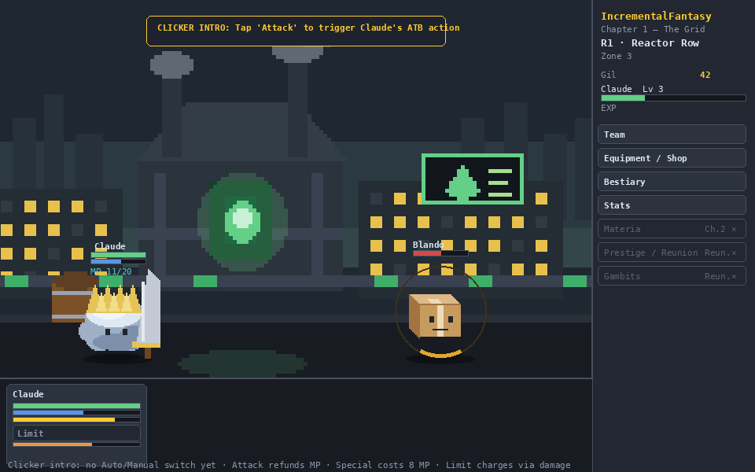
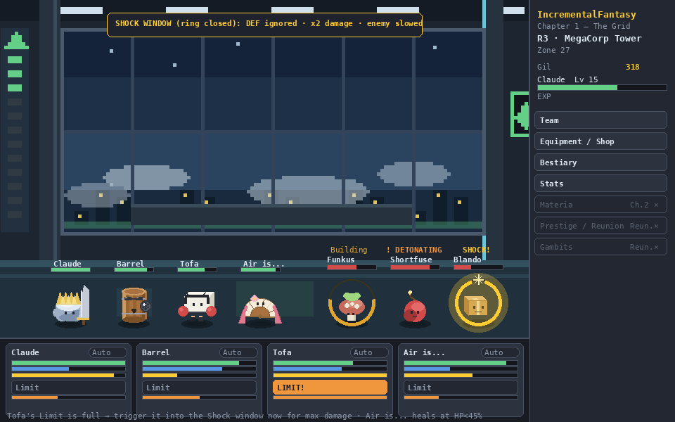
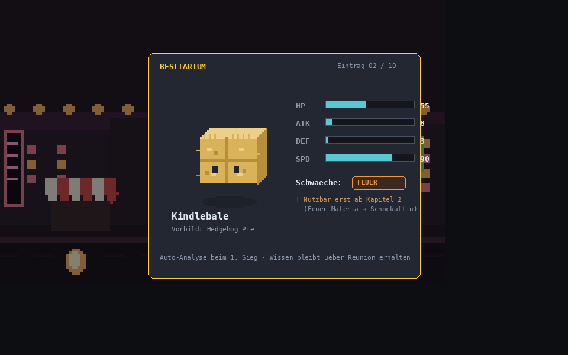
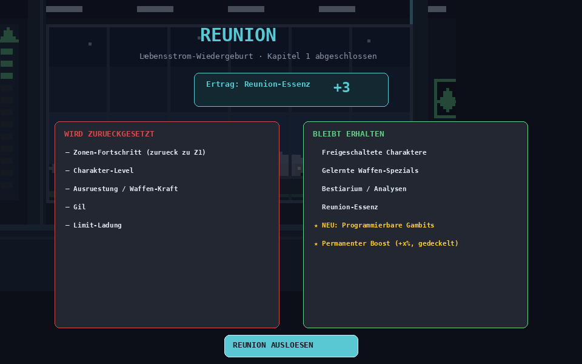
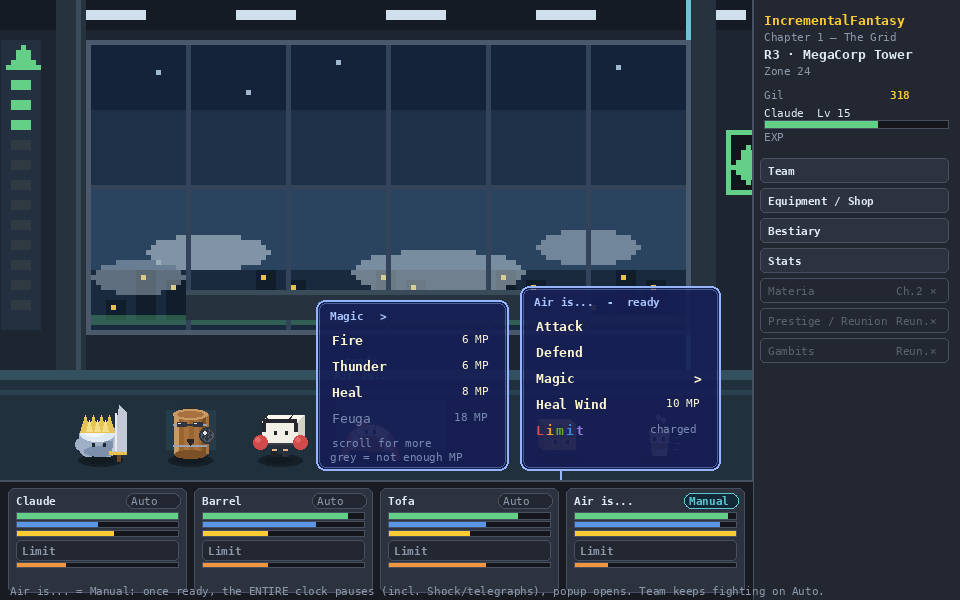
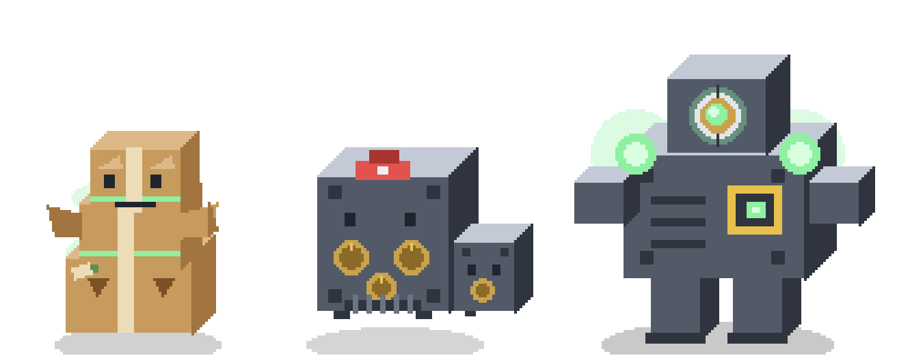

# Feinspec Kapitel 1 – „The Grid" (Zyklus 1, bis zur 1. Reunion)

**Status:** Implementierungsnahe Feinspec. Alle Zahlen sind eine **simulationsvalidierte Playtest-Baseline** (kein finaler Balance-Stand) – siehe §11. Formeln, Datenmodelle und der Tick-Loop sind so gehalten, dass ein Prototyp direkt daraus gebaut werden kann.
**Rahmen:** `../03_Konzept_Gerüst.md` (Anker) + die betroffenen `spec/*.md` (siehe Schnittstellen).
**Prüfinstanz:** `../02_Leitfaden_Kernmechaniken.md`. Leitplanken-Check in §10.
**Validierung:** Kampf-/Pacing-Simulator `assets/sim/sim_chapter1.py` (deterministisch, ATB-getaktet). Alle Pacing-Zahlen in §8 stammen aus einem Durchlauf dieses Simulators.

## Schnittstellen zu anderen Systemen

- **Kampf/Shock** (`kampf-analyse-shock.md`): ATB-Takt, MP-Kanäle, Shock-Fenster, Limit, Analyse.
- **Stats** (`stats-kampfwerte.md`): Kern-Stats, Schadens-/ATB-Formel, Level-Wachstum.
- **Progression** (`progression-regionen.md`): 3 Regionen, Roster-Rhythmus, Gate-Struktur.
- **Encounter** (`encounter-zyklus1.md`): Monster-Platzierung Z1–Z30, Skalierung `g`.
- **Gegner** (`gegner-katalog.md`): 7 in Zyklus 1 aktive Monster + 3 Gates.
- **Ausrüstung** (`ausruestung-gil.md`): in Kapitel 1 **ohne Funktion** – Gil und Waffen-Tiers sind gestrichen (30.07.2026), der Special läuft über einen Zonen-Trigger, Slots kommen erst Kap. 2.
- **Ökonomie** (`oekonomie-waehrungen.md`): aktiv nur **EXP** (+ MP als Kampf-Ressource) – EXP ist seit der Gil-Streichung die einzige Run-Währung.
- **Niederlage/Offline** (`niederlage-offline.md`): Zeitstrafe, Retry, Offline-Ernte.
- **Prestige** (`prestige-reunion.md`): 1. Reunion = Reset/Persistenz + Gambit-Freischaltung.
- **UI** (`ui-layout.md`): Stage/Bottom/Sidebar-Budget; hier als konkrete Screens umgesetzt.

---

## 0. Geltungsbereich: Was Kapitel 1 enthält – und was bewusst nicht

**Enthalten (der komplette erste Spielabschnitt):** Kern-Loop (Auto-Battle → EXP), ATB, manueller Klicker-Auftakt, Auto-Attack-Regel, Waffen-Specials der 4 Figuren, Limit als Wand-Brecher, MP als Limiter, Zielwahl, Bestiarium (still, ohne Analyse-Mechanik – §1.3), Shock (neutral, langsam), Niederlage/Retry, Mechanik-Einführungen (Popup + Codex), die 1. Reunion.

**Nicht mehr enthalten:** Gil und Ausrüstungskauf (gestrichen 30.07.2026, §6.4), Offline-Ernte (stillgelegt seit M11, §3.8e).

**Bewusst NICHT enthalten** (öffnet ab Kapitel 2 / 1. Reunion, vgl. `progression-regionen.md` §2):
Materia & Slots, Magie/Zauber, AP-Ökonomie, Materia-Prestige, der **programmierbare** Gambit-Editor (in Kap. 1 laufen nur die fest verdrahteten Default-Regeln aus §4.7), Element-Schwächen als **nutzbare** Mechanik (Kindlebales Feuer-Schwäche ist reiner Teaser), Resistenzen, Summons. Der dritte MP-Kanal (Zeit-Trickle) ist in Kap. 1 noch inaktiv.

---

## 1. Systemüberblick in vier Screens

Die folgenden Mockups sind aus den vorhandenen Pixel-Assets (`assets/characters`, `assets/monsters`, `assets/regions`) komponiert und zeigen das Zielbild. Reproduzierbar über `assets/sim/make_mockups.py`. Layout-Budget nach `ui-layout.md`: Stage ~78 %, Bottom-Leiste ~20 %, Seitenleiste ~22 %.

### 1.1 Region 1 – Klicker-Auftakt (Claude solo)



Der Einstieg: nur **Claude** gegen einen einzelnen **Blando** vor der Reactor-Row-Kulisse. Der Spieler wählt anfangs jede ATB-Aktion selbst (Banner oben). MP ist gerade sichtbar geworden (erster Waffen-Special). Unten Claudes Panel mit HP/MP/ATB und der ladenden **Limit**-Leiste. **Noch kein Auto/Manuell-Schalter sichtbar** – der erscheint erst mit der Default-Attack-Freischaltung (Zone 5, `gambits.md` §6). **Playtest-Learning (wichtig für die Implementierung):** Vor dieser Freischaltung darf die UI **keinerlei Modus-Anzeige** zeigen (auch keinen reinen Text-Hinweis) – sonst spoilert sie die Automatik, bevor der Spieler sie verdient hat. `assets/sim/make_mockups.py` rendert diesen Screen bereits korrekt ohne Modus-Anzeige (`show_mode=False`); diese Beschreibung war der Widerspruch dazu und ist hiermit behoben.

### 1.2 Region 3 – Volle Party & Shock-Fenster



Der Kampf in seiner vollen Kapitel-1-Form: alle vier Figuren, drei Gegner. Ein **Blando ist geschockt** – **voller goldener Ring + Bruch-Symbol** (DEF ignoriert, ×2 Schaden, verlangsamt); der **Funkus** daneben zeigt seinen **Shock-Aufbau** als von unten gefüllten Ring. **Shortfuse** telegrafiert seine Selbstzerstörung („! DETONATING"). **Tofas Limit ist voll** (leuchtet orange) – der aktive Spieler zündet es jetzt ins Shock-Fenster. Modus „Auto" (Default-Regeln laufen selbst) – ab hier zulässig, da die Automatik seit Zone 5 freigeschaltet ist. Shock-Ring-Farbe & -Symbolik: `kampf-analyse-shock.md` §6.

### 1.3 Analyse & Bestiarium



Beim ersten Sieg über eine Art wird sie automatisch analysiert. Die Karte zeigt Grundstats (HP/ATK/DEF/SPD) und eine sichtbare **Schwäche** – hier Kindlebales Feuer, explizit markiert als **erst ab Kapitel 2 nutzbar** (Köder). Wissen bleibt über Reunion erhalten.

**Präzisiert am 01.08.2026 (`kampf-analyse-shock.md` §5):** Das Bestiarium beschreibt die Gegner-**Art**, nicht die zonen-skalierte Instanz – Stats erscheinen als **relative Balken**, Verhalten als **Tags**, **niemals absolute Zahlen**. In Kapitel 1 ist es ein **stilles** Sammel- und Köder-Objekt: Es füllt sich beim Erst-Kill, wird aber nicht durch ein Einführungs-Popup beworben. **Analyse als bedienbare Mechanik gehört nach Kapitel 2** (Materia/Element-Wahl); erst dort trägt sie eine Entscheidung.

### 1.4 Die 1. Reunion



Am Kapitelende: die klaren **Reset-** vs. **Persistenz-Listen** und der Ertrag in **Reunion-Essenz**. Die 1. Reunion ist der Sonderfall, der zusätzlich die **programmierbaren Gambits** und einen ersten permanenten Boost freischaltet.

### 1.5 Manuelle Steuerung – Aktions-Popup



Die manuelle Steuerung als **FF7-Menübox** am Charakter-Panel: dunkle Blau/Lila-Box, helle Schrift. **Air is...** steht auf **Manual** (cyan Chip), das übrige Team auf **Auto** – wird Air is... bereit, pausiert die gesamte Uhr und ihr Popup öffnet. **Grundaktionen** (Attack, Defend, Special „Heal Wind") stehen fix; **Limit** erscheint in **bunten Buchstaben**, wenn geladen; **nicht nutzbare Aktionen** bleiben sichtbar, aber **ausgegraut + dünn** (hier „Feuga – not enough MP"). Materia lebt unter der Kategorie **„Magic ▸"** als scroll-/blätterbare Unterliste – das Popup bleibt gleich groß, egal wie viele Zauber. Verhalten & Rollout: §5.1 sowie `gambits.md` / `ui-layout.md`. *(Hier im ausgebauten Zustand gezeigt; Defend und die Magic-Kategorie erscheinen erst ab ihren Freischaltungen – in Kapitel 1 zunächst nur Attack/Special/Limit.)* **UI-Sprache (verbindlich):** alle Aktions-/Modus-Labels, die tatsächlich im Spiel zu sehen sind (Buttons, Chips, Kategorien, Telegrafs), sind **Englisch** – konsistent mit der Namenskonvention für Code/Identifiers (CLAUDE.md). Nur die Spezifikations-**Prosa** bleibt Deutsch.

---

## 2. Globale Konstanten (Playtest-Baseline)

| Konstante | Symbol | Wert | Quelle/Begründung |
|-----------|--------|------|-------------------|
| ATB-Basisintervall | `BASE_T` | **2,0 s** | `stats-kampfwerte.md`; SPD 100 = 1 Aktion / 2 s |
| Zonen-Wachstumsfaktor | `g` | **1,07** | glatt Zone-für-Zone; sim-justiert (Spec-Vorschlag war 1,08) |
| ~~Regions-Stufe Gegner-Basis~~ | ~~`REGION_STEP`~~ | **entfällt** (Messung, s. §3.7) | gegen die TS-Engine validiert und **verworfen**: die Aufweichung, die sie auffangen sollte, tritt nicht ein |
| Tick-Auflösung | `DT` | 0,1 s | Simulations-/Loop-Takt |
| Shock-Schwelle | `SHOCK_MAX` | 100 | willkürliche Einheit |
| Shock-Fensterdauer | `SHOCK_WINDOW` | 6,0 s | im Spec-Band 5–8 s |
| Shock-Schadensmultiplikator | – | ×2,0 | im Fenster |
| Shock-Verlangsamung Gegner-ATB | – | ×0,3 | Gegner „stark verlangsamt" |
| Limit-Cap | `LIMIT_MAX` | 100 | **nur in Gate-/Boss-Kämpfen**; startet dort bei 0, kein Übertrag (§3.4) |
| Zeitstrafe bei Niederlage | `RETRY_PENALTY` | 5,0 s | „milde Zeitstrafe"; heilt **nichts** (§3.8) |
| HP/MP-Erholung nach Sieg | `VICTORY_RECOVERY` | +25 % Maximum | einziger kostenloser Kanal; HP **und** MP gleich (§3.5) |
| ~~MP-Refund pro Angriff (Kanal 3)~~ | – | **gestrichen** | MP ist jetzt ein Kampf-Budget, kein Rotations-Kreisel (§3.5) |
| MP-Trickle über Zeit (Kanal 2) | – | **inaktiv** in Kap. 1 | öffnet später |
| Gasthaus-Totzeit | `INN_DEAD_TIME` | 10,0 s | Fixkosten gegen Heil-Spam (§3.8) |
| Gasthaus-Erholungsrate | `INN_RATE` | 5 %/s vom Maximum | HP und MP **gleichzeitig** (§3.8) |
| ~~Offline-Rate / Offline-Deckel~~ | – | **entfernt** | Offline-Progress stillgelegt (§3.8) |

**Level-Wachstum pro Stufe** (multiplikativ auf den Basiswert, angewandt auf das **Gruppenlevel**, `stats-kampfwerte.md` §4.1): HP ×1,09 · ATK ×1,055 · MAG ×1,055 · DEF ×1,05 · SPD ×1,00 (SPD bleibt Build-Hebel). Dass ATK (5,5 %/Level) knapp unter `g` (7 %/Zone) liegt, ist Absicht: die Party fällt über eine Region minimal zurück → am Gate steht eine spürbare, grindbare Wand (Ventil-Prinzip bleibt: EXP fließt weiter).

**EXP für den nächsten Level:** `exp_to_next(L) = round(20 · 1,22^(L-1))`. Kalibriert auf ~1 Levelaufstieg pro Zone, damit die Kampfdauer über das Kapitel ungefähr konstant bleibt. **Die Kurve bleibt durch die Umstellung auf das Gruppenlevel unverändert:** Bisher erhielt jede Figur die volle Wellen-Summe: „Party-Topf bekommt die Wellen-Summe" ist exakt dieselbe Rate wie zuvor Claudes.

---

## 3. Kern-Formeln

Alle deterministisch – **kein RNG** (kein Crit, kein Miss/Dodge), gemäß `stats-kampfwerte.md` §2.

### 3.1 Schaden (Mitigations-Kurve)

```
schaden(ATK, DEF) = max(1, round( ATK² / (ATK + DEF) ))
```

Hohe DEF macht zäh, aber nie unverwundbar. Magie-Schaden analog aus MAG. **Im Shock-Fenster** wird DEF als 0 gesetzt **und** das Ergebnis ×2 genommen – der gezielte Konter gegen Panzer (Safeguard).

*Beispiel:* Claude L1 (ATK 14) gegen Blando (DEF 2): `196/16 = 12` pro Treffer → 4 Angriffe für 40 HP → mit `BASE_T` genau **8 s** (deckt sich mit der Plausibilisierung in `stats-kampfwerte.md`).

### 3.2 ATB-Takt

```
atb_intervall(SPD)   = BASE_T · 100 / SPD          # Sekunden bis zur nächsten Aktion
füllrate_pro_tick    = DT / atb_intervall(SPD)      # * Modifikatoren (Shock, Suppress)
```

Ein geschockter Gegner füllt mit ×0,3; ein unterdrückter (Barrel) mit ×0,5. SPD 100 → 2,0 s; SPD 130 (Tofa) → 1,54 s; SPD 180 (Caffiend) → 1,11 s.

### 3.3 Shock-Aufbau

```
bei Treffer (Gegner NICHT im Fenster):
    shock += schaden · 0,5 + shock_bonus        # Tofa-Special: shock_bonus = 45
    wenn shock >= 100:  fenster starten (6 s), shock = 0
```

Neutral (alle Kap.-1-Gegner) baut also nur über Schaden auf – langsam, aber real. Tofas Special ist der Beschleuniger, bis in Kap. 2 Element-Materia den „Schockaffin"-Zustand auslöst.

**Anzeige & Zeitkopplung:** Der Shock-Stand erscheint als **Ring um den Gegner** in **Gold/Bernstein** (Amber `#e0a52e` im Aufbau, Gold `#ffcc33` im aktiven Fenster) – nicht Lila. Der Ring **füllt sich von unten** (Nähe zum Schock), schließt sich bei 100 % mit einem **Bruch-/Funken-Symbol** und **leert sich im Fenster von oben** (verbleibende Zeit). Voller Detail-Steckbrief: `kampf-analyse-shock.md` §6. **Auf- und Abbau laufen ausschließlich bei laufender Kampfuhr** – die Bedenkzeit-Pause (§5) friert den Shock-Timer mit ein.

### 3.4 Limit-Ladung (Esper-Modell, revidiert)

**Revision:** Die Erstfassung ließ die Limit-Leiste über den ganzen Run persistieren („aufgeladen an der Wand ankommen"). Mit der Zonen-Rückkehr (§3.8) wird das zu einem **Vorab-Farm-Exploit**: Man lädt das Limit in einer trivialen Zone auf und betritt die Wand mit voller Leiste – der Wand-Brecher entwertet sich selbst. Ersetzt durch das Esper-Modell aus FF7 Remake:

```
Verfügbarkeit: NUR in Encountern mit `limitAllowed: true` (§4.3) – in Kap. 1
               exakt die drei Gates (Blandzilla Z8, Fort Knoxious Z18, Vaultron Z30).
Start:         limit = 0 zu Beginn jedes solchen Kampfes. Kein Übertrag, nirgends.
Ladung:        zugefügter Schaden:  limit += 110 · (schaden / maxHP des Ziels)
               erlittener Schaden:  limit += 140 · (schaden / eigene maxHP)
                                    (AoE: · 0,75 des Werts, je Figur)
               (angehoben von 60/80 am 02.08.2026 – Begründung unten)
Zünden (Kap. 1, generisch): schaden(4,5·ATK, DEF) mit DEF-Ignore auf das stärkste Ziel.
```

Damit ist Limit kein Dauer-Knopf mehr, sondern ein **Ereignis, das ausschließlich an Wänden existiert** und sich dort vor den Augen des Spielers aufbaut. Die Laderaten sind so zu justieren, dass die Leiste in einem Gate-Kampf **ein- bis zweimal** voll wird – sie wird damit zum Taktgeber innerhalb des Kampfes statt zu einer vorab mitgebrachten Ressource.

Das schärft zugleich den Wert manuellen Spiels genau dort, wo er hingehört: Limit lebt künftig nur noch in den Kämpfen, die `gambits.md` §4 ohnehin als **manuelle Prüfsteine** vorsieht. Aktives Timing ins Shock-Fenster holt weiterhin spürbar mehr heraus.

**Revision der Laderaten: relativ statt absolut (Konzept-Review 01.08.2026, nach dem M17-Playtest).** Die bisherigen Raten (`schaden · 0,35` bzw. `· 0,50`; im Code zuletzt `0,2`/`0,3`) hingen an **absoluten** Schadenszahlen, während `LIMIT_MAX` fix bei 100 liegt.

*Befund:* An Blandzilla (Zone 8) kam das Limit als **letzter Hit** des Kampfes – der Spieler konnte nicht erkennen, was es überhaupt gebracht hat. Das Soll „ein- bis zweimal voll" war damit messbar verfehlt. Nachgerechnet: Blandzilla hat zonenskaliert ~209 HP, für eine volle Leiste aus zugefügtem Schaden wären bei `0,2` aber **500 Schadenspunkte** nötig gewesen – mehr als doppelt so viel, wie der Gegner überhaupt besitzt. Claude konnte die Leiste aus eigener Kraft also **gar nicht** füllen; der Rest musste aus erlittenem Schaden kommen, weshalb sie erst kurz vor dem Kampfende volllief.

*Wurzel:* Schaden und HP wachsen über Zone (`ZONE_GROWTH`) und Level, `LIMIT_MAX` nicht. Die Ladegeschwindigkeit **driftet dadurch über das Kapitel** – an Zone 8 zu langsam, an den späteren Gates von allein zu schnell. Eine Nachjustierung der Rate hätte dieselbe Zahl mehrfach fällig gemacht.

*Beschluss:* Die Ladung hängt jetzt am **Anteil** statt am Betrag – am Anteil der Ziel-maxHP beim Austeilen, am Anteil der eigenen maxHP beim Einstecken. Damit ist die Leiste zonen- und levelstabil ohne weitere Playtest-Zahl, und sie liefert genau das intendierte Gefühl: **das Limit kommt, wenn es ernst wird.** Wer einen Gegner im Alleingang niederschlägt, hat ~60 % Leiste; wer 80 % seiner HP verloren hat, ~64 %. An Blandzilla fällt es dadurch bei etwa 60 % Kampffortschritt – früh genug, dass der Einbruch im HP-Balken sichtbar ist.

*Verworfen – nur die beiden Raten anheben* (`0,2 → 0,35`, `0,3 → 0,45`): behebt Blandzilla sofort und für wenige Minuten Arbeit, lässt die Drift aber bestehen; dieselbe Entscheidung stünde in Zone 20 erneut an. Die relative Form kostet einmalig eine Neuprüfung des ganzen Kapitels und ist danach erledigt.

*Ausdrücklich NICHT gemacht – Blandzillas ATK senken.* Der naheliegende Wunsch „weniger Schaden bekommen, damit es nicht so knapp wird" **verschlimmert den gemeldeten Befund**: Erlittener Schaden ist der stärkere der beiden Ladekanäle, ein ATK-Nerf ließe das Limit also noch später kommen. Blandzillas Werte (§6.2) bleiben unverändert, ebenso die Knappheit des Kampfes – „ich habe alles benutzt, was verfügbar war, und knapp gewonnen" ist das designte Gefühl eines Gates (`gegner-encounter.md` §7), nicht der Fehler.

*Ebenfalls Teil des Befunds, aber Anzeige statt Zahl:* Der Limit-Treffer muss sich **absetzen** – große Schadenszahl und ein sichtbarer „DEF ignoriert"-Marker. Auch als letzter Hit soll ablesbar sein, was er ausgerichtet hat.

**Anhebung der Ladehöhe: das Soll „ein- bis zweimal voll" war nie eingelöst (Playtest 02.08.2026).**

*Befund:* Blandzilla mit Party-Level 6–7, knapper Kampf, angemessenes Level – trotzdem: zwei Specials, danach nur noch Attack, **Limit voll, aber nicht gebraucht.** Die relative Ladung (oben) hat die Drift beseitigt, nicht die Höhe: Die Leiste läuft bei ~60 % Kampffortschritt voll, also **einmal**, mit nur noch 40 % Kampf zum Wirken.

*Wurzel:* Das Soll oben verlangt „ein- bis **zwei**mal voll"; die Werte 60/80 liefern strukturell nur eine Zündung, und die spät. Der eigentliche Verlust ist nicht Schaden, sondern **Ablesbarkeit**: Ein Limit auf einen noch vollen Gegner-HP-Balken zeigt sichtbar, was es ausrichtet – am Kampfende ist derselbe Schaden unsichtbar, weil der Gegner ohnehin fällt.

*Beschluss:* Ladehöhe anheben. **Zielgröße: erste volle Leiste bei ~30–35 % Kampffortschritt, zweite gegen Ende.** Das löst „ein- bis zweimal" erstmals ein, gibt dem ersten Limit sichtbare Wirkung und behält den zweiten als Finisher.

⚠️ **Die eingetragenen 110/140 sind eine Annahme aus der Konzept-Session, keine gemessene Zahl.** Welcher Faktor die 30–35 % trifft, ist nur an der Sim/Engine zu ermitteln – die Umsetzungs-Session justiert gegen die Zielgröße, nicht gegen die Zahl.

*Grenze nach oben (wichtig für Kapitel 2):* Noch früher kippt zurück in den Ur-Befund „Limit fühlt sich an wie die Spezialattacke" – die Rechtfertigung des Esper-Modells. Zusätzlich kollidiert eine sehr frühe Leiste mit dem Shock-Fenster ab Kapitel 2: Wer mit voller Leiste auf den Schock wartet, verliert jede weitere Ladung – **Aufheben würde bestraft statt belohnt.** Deshalb steigt die Rate **jetzt** und **ab Kapitel 2 nicht weiter**; dort trägt der Shock-Multiplikator den Wert des Limits, nicht seine Häufigkeit (`kampf-analyse-shock.md` §4/§6).

*Verworfen – mit Teilladung starten* (z. B. 25 % zu Kampfbeginn statt höherer Rate): trifft denselben Zeitpunkt bei kleinerem Eingriff, aber die Leiste begänne als Geschenk statt als etwas, das der Kampf erzeugt. Das Esper-Gefühl („baut sich vor deinen Augen auf") lebt genau vom Start bei 0.

*Nicht Teil dieses Beschlusses:* Blandzillas Werte (§6.2) bleiben unverändert – der Kampf war knapp, das Level angemessen. Das ist nicht der Fehler.

**Umsetzungs-Rückstand (nächste Umsetzungs-Session):** `limitGainOnDealt`/`limitGainOnTaken` in `core/formulas.ts` auf die relative Form umstellen (beide brauchen jetzt die maxHP-Bezugsgröße als Parameter – Aufrufer in `core/battle.ts` und `core/tick.ts`); Limit-Trefferanzeige aufwerten; `tests/chapter-playthrough.test.ts` gegen alle drei Gates neu prüfen, Sollwert unverändert „ein- bis zweimal voll pro Gate-Kampf". **Ergänzt 02.08.2026:** Die Faktoren auf 110/140 anheben und **gegen die Zielgröße „erste volle Leiste bei ~30–35 % Kampffortschritt" justieren** – die 110/140 sind der Startwert, die Zielgröße ist die Vorgabe. Test entsprechend erweitern (nicht nur *ob*, sondern *wann* die Leiste voll wird).

*Playtest-Befund, der zu dieser Revision führte:* Limit fühlte sich „wie die Spezialattacke an, nichts Besonderes" – genau weil es überall verfügbar war. Der in der Vorfassung unter §11 vermerkte Implementierungsfehler (Leiste fiel bei jedem Zonenstart auf 0) **entfällt damit ersatzlos**; das Esper-Modell macht das frühere Soll-Verhalten überflüssig, statt es nachzurüsten.

### 3.5 MP – ein Kampf-Budget (revidiert, nur noch ein Kanal)

**Revision:** Kanal 3 (`+2 MP pro Angriff`) ist **gestrichen**. Mit ihm war MP eine *rotierende* Ressource, die sich innerhalb eines Kampfes selbst repariert („leer → angreifen → wieder da"); der Special war damit faktisch die Standardaktion statt eines taktischen Werkzeugs. Ohne ihn ist MP ein **Budget pro Kampf mit hartem Deckel**.

```
Kanal 1 – nach jedem Sieg:  mp += 0,25 · max_mp   (einziger kostenloser Kanal)
Kanal 2 – Gasthaus:         mp += 0,05 · max_mp je Sekunde (§3.8)
Special-Kosten: siehe §6.1. Reicht MP nicht, ist der Special schlicht nicht
verfügbar (im Popup sichtbar, aber ausgegraut – `gambits.md` §3).
```

**MP trägt zwischen den Kämpfen über** (§4.1) – das ist die eigentliche Änderung. Vier gewonnene Kämpfe füllen die Leiste von leer auf voll; die Entscheidung, MP in einer leichten Zone **nicht** auszugeben, wird damit selbst zum Zug: Man bankt Ressourcen in sicheren Zonen und gibt sie an der Wand aus. Genau dieser Vorbereitungs-Loop ist der Sinn der Zonen-Rückkehr (§3.8).

**Konsequenzen, die mitzuvalidieren sind:**
- Alle Special-Kosten in §6.1 wurden gegen den gestrichenen Refund balanciert und sind **neu herzuleiten**.
- Air is…' Heilung bekommt damit eine **harte Obergrenze pro Kampf** – Bosskämpfe werden zusätzlich zu einem Ausdauer-Rätsel. Bei Vaultron (AoE alle 3 Aktionen) gewollt, aber simulationspflichtig.
- Der frühere Selbstheilungs-Satz „MP leer → Angriff → MP zurück" entfällt. Für Kapitel 1 folgenlos (Auto greift ohnehin nur an, §4.7), für den **Gambit-Editor in Kapitel 2** relevant: Eine Regel „nutze Special" kann dauerhaft ins Leere laufen, statt sich selbst zu reparieren. Gehört in die Kapitel-2-Spec.
- MP-Regen-Materia (`materia.md` §7) wird dadurch von „wirkungslos" zu einer der attraktivsten Kapitel-2-Belohnungen – die Rolle, die ihr `materia.md` §2 zuweist. **Deshalb darf Sustain in Kapitel 1 bewusst nicht gut gelöst sein.**

### 3.6 EXP / Gruppenlevel

```
Sieg → der Party-EXP-Topf erhält die Summe der Monster-EXP der Welle,
       MULTIPLIZIERT mit der Level-Dämpfung dieser Zone (s. u.).
Level-Up des GRUPPENLEVELS sobald exp >= exp_to_next(L); Überschuss überträgt.
Ein Level-Up hebt alle Figuren gleichzeitig; Neuzugänge stehen sofort auf L.
Monster-EXP skaliert mit g^(zone-1) wie die Stats (§3.7).
```

**Gil ist gestrichen** (30.07.2026). Kein Gil-Ertrag, kein `gil`-Feld im Save, keine Monster-Gil-Spalte, kein Shop, keine Waffen-Tiers. Begründung und die verworfenen Alternativen: `oekonomie-waehrungen.md`, Abschnitt „Gil ist gestrichen". **EXP ist damit die einzige Run-Währung** – diese Kurve ist nicht mehr eine von zwei Ökonomien, sondern *die* Ökonomie.

**Level-Dämpfung (neu, ersetzt den unbegrenzt gleichhohen Ertrag):**

```
erwartetes Level einer Zone: L_erw(zone)   # aus der Zonen-Kurve ABGELEITET,
                                           # nicht als Tabelle gepflegt
Überschuss  u = max(0, partyLevel - L_erw(zone))
EXP-Faktor  f(u):  f = 1 für u <= PLATEAU
                   f fällt für u > PLATEAU, aber NIE auf 0
```

**Warum überhaupt:** Im zweiten Playtest war **reines Idle die stärkste Spielweise** – tief farmen, wo man überlevelt ist, bis der Kapitel-Boss von selbst fällt. Die Zonen-Rückkehr war damit von der Notausgangs- zur Optimalstrategie geworden. Ursache ist die **Rate, nicht die Menge**: EXP pro Kill ist tief unten niedriger, EXP **pro Sekunde** aber höher, weil die Kill-Zeit zusammenbricht.

**Warum Level × Zone und nicht Abstand zu `maxZoneReached`:** Ein Abstands-Taper verschiebt nur das Fenster – wer Zone 7 erreicht hat, farmt Zone 5, die bei seinem Level längst trivial ist. Der Exploit wandert, statt zu verschwinden. Level × Zone ist absolut; `maxZoneReached` kommt in der Formel nicht vor.

**Anforderungen an `PLATEAU` und die Sturzform** (⚠️ beides ungemessen, erster Prüfpunkt der Umsetzung):

- **Plateau breit genug** (~+2–3 Level), damit „ein bis zwei Zonen zurück, dann geht es" bezahlbar bleibt. Das ist der legitime Ventil-Gebrauch und schützt Leitplanke A3.
- **Sturz steil genug**, damit blindes Idle den Kapitel-Boss nicht in einer Stunde umlegt.
- ✓ **Gemessen (M15, `07_Umsetzungsentscheidungen.md` Umsetzungsentscheidung 50/52):** Beides geht gleichzeitig. Startwerte: Plateau 2,5 Level, exponentieller Decay 0,72/Überschuss-Level, Floor 0,03 (nie 0). Typ V (§12) braucht dadurch 67,3 statt 53,2 min (Faktor 4,99× statt 3,4× gegenüber Typ M), M/T bleiben nahezu unverändert bei 13,5/43,7 min.

  | Typ | Gesamtzeit (M15, gedämpft) | Verhältnis zu M | zuvor (ungedämpft, §7.4) |
  |-----|:---------------------------:|:-----------------:|:--------------------------:|
  | **M** | ~13,5 min | 1,0× (Referenz) | ~13,3 min |
  | **T** | ~43,7 min | ~3,24× | ~42,8 min |
  | **V** | ~67,3 min | ~4,99× | ~53,2 min |
- Der EXP-**Bedarf** steigt bereits mit `1,22^(L-1)`; die Ertragsdämpfung kompoundiert damit gezielt bei Typ V (der einzige Typ, der spürbar überlevelt farmt) – M/T sind kaum betroffen, weil sie kaum Reserve-Level anhäufen.

Ein Level für die gesamte Party – Begründung, Playtest-Befund und die verworfenen Alternativen stehen in `stats-kampfwerte.md` §4.1. Für die UI heißt das: **ein** Level-/EXP-Anzeiger für die Gruppe statt vier pro Charakter-Panel (`ui-layout.md`).

### 3.7 Zonen-Skalierung

```
effektiver Monster-Stat = basis · g^(zone_index - 1)     # g = 1,07
Zonen-Index läuft über das ganze Kapitel durch:
    Region 1 = Zonen 1–8, Region 2 = 9–18, Region 3 = 19–30.
Gate-Spike = die Gate-Basiswerte (§6.2) liegen bereits ~1,6–1,8× über der
letzten regulären Zone der Region.
Größen-/Farbvarianten streuen ±15 % (kleiner = schwächer/schneller).
```

**Die Regions-Stufe wurde eingeführt und wieder verworfen – gemessen, nicht geschätzt.** Mit dem Gruppenlevel wurde hier eine Stufe auf die Gegner-Basiswerte vorgesehen (×1,5 ab Zone 9, ×1,4 ab Zone 19), gegen die Erwartung, dass R2/R3 sonst zu leicht würden: Barrel (Z9) und Tofa+Air is… (Z19) stoßen jetzt voll skaliert dazu, der Party-DPS springt also dort, wo die `g`-Kurve glatt weiterläuft. Der Wert war ausdrücklich als Schätzung markiert und gegen die TS-Engine zu validieren (§11).

**Die Messung widerlegt die Erwartung.** Gegen `tests/chapter-playthrough.test.ts` (die drei Spielertypen aus §12) trifft das Kapitel **ohne** Stufe die §7.4-Baseline nahezu exakt – Gesamtzeit M 13,3 / T 42,8 / V 53,2 min gegen die dort dokumentierten 15,6 / 44,3 / 53,0. Mit ×1,5/×1,4 explodiert sie auf 84 / 177 / 203 min; schon ×1,15/×1,1 verfehlt mehr Kriterien als gar keine Stufe. Der Grund: Der Party-EXP-Topf levelt exakt so schnell wie zuvor Claude allein (jede Figur bekam schon vorher die volle Wellen-Summe), und der Zugewinn durch einen voll skalierten Neuzugang ist kleiner als der Gegendruck einer multiplikativen Stufe auf **alle** Gegnerwerte einer ganzen Region. Die Gegnerkurve bleibt deshalb die reine `g`-Kurve. Details: `07_Umsetzungsentscheidungen.md`, Umsetzungsentscheidung 42.

**Was der Roster-Sprung stattdessen bewirkt:** Er verschiebt Niederlagen aus der Fläche an die Gates (Typ V an Z30: 16 statt 11 Retries, dafür weniger in Region 2) – im Sinne von §12 C4 die gewollte Richtung, bei praktisch unveränderter Gesamtzeit.

### 3.8 Die Ventil-Kette: Zonen-Rückkehr, Gasthaus, Niederlage (revidiert)

**Der schwerste Fund des ersten Playtests.** Die Vorfassung dieses Abschnitts beschrieb einen Retry auf *derselben* Zone bei „frischer Party" – und behauptete, wiederholte Niederlagen seien „das Signal grinden/verbessern". Beides zusammen ergibt in einer **deterministischen** Engine (kein RNG, §3.1/§10) einen **permanenten Totalstopp**: Wer eine Zone einmal verliert, verliert sie bitgenau identisch, unendlich oft. Es gab keinen Ort, an dem man hätte grinden können – `currentZone` wurde ausschließlich hochgezählt –, und EXP/Gil flossen nur bei Sieg. Damit war ausgerechnet **Anti-Pattern #1 („Fortschritts-Wände ohne Ventil", `02_Leitfaden_Kernmechaniken.md` §4)** verletzt, der häufigste Kritikpunkt am ganzen Genre.

Die simulationsvalidierte Baseline (§7.4) hat das nicht gezeigt, weil der Test-Harness bei jeder Niederlage **an der zuletzt geschafften Zone farmt** – eine Mechanik, die es im Spiel nie gab. Die Simulation maß ein anderes Spiel als das ausgelieferte.

Ersetzt durch drei ineinandergreifende Regeln:

#### (a) Zonen-Rückkehr – das Ventil

```
Jede bereits geschaffte Zone ist jederzeit frei anwählbar (vor und zurück).
Dort gewonnene Kämpfe zahlen EXP aus – unbegrenzt wiederholbar, aber **nach Level × Zone gedämpft** (§3.6), damit Tieffarmen nicht die beste Strategie ist.
Die höchste je erreichte Zone bleibt gespeichert; Rückkehr verliert nichts.
```

Das ist das Genre-Standardmuster („push bis zur Wand, dann farmen", Vorbild Trimps, `02_Leitfaden_Kernmechaniken.md` §1 D2) und macht den Skill↔Zeit-Tausch aus `gambits.md` §4 überhaupt erst einlösbar: **manuell gut spielen** *oder* **eine Zone zurück und stärker werden**. Beide Wege führen durch die Wand.

Bewusst **kein** Automatismus: Der Spieler wählt die Zone selbst. Ein automatischer Rückfall bei Niederlage ist als spätere Komfortstufe denkbar, aber nicht Teil dieser Fassung – erst muss die Handlung existieren, dann darf man sie automatisieren (`02_Leitfaden_Kernmechaniken.md` §4 #2).

#### (b) Gasthaus – der Heilkanal

```
Anmeldung:  jederzeit umschaltbar („nach diesem Kampf ins Gasthaus").
            Greift erst nach Ende des laufenden Kampfes, nie mittendrin.
            Bei Niederlage automatisch aktiv.
Ablauf:     INN_DEAD_TIME = 10 s, in denen NICHTS geheilt wird (Fixkosten),
            danach INN_RATE = 5 %/s auf HP UND MP gleichzeitig.
Kosten:     ausschließlich Zeit. Kein Gil.
Limit:      unberührt – existiert außerhalb von Gate-Kämpfen ohnehin nicht (§3.4).
```

Voll heilen aus dem Nichts dauert damit **30 s** (10 s Totzeit + 20 s Erholung). Die Totzeit ist der eigentliche Design-Kern: Sie macht häufiges kleines Nachheilen unwirtschaftlich und belohnt „weiterkämpfen, bis man es wirklich braucht" – eine Optimierungsfrage mit echter Antwort statt einer Selbstverständlichkeit.

**Warum Zeit statt Gil:** Ein Gil-Preis kann in einen Deadlock laufen (wenig HP + kein Gil = kein Ausweg). Zeit kann das nie. Zudem ist die gesamte Ökonomie ohnehin in Zeit denominiert. *Nebenwirkung:* Gil hat damit weiterhin nur **einen** Sink (Waffen) – ein zweiter bleibt offen (`oekonomie-waehrungen.md`).

Dass der Gasthaus-Besuch **vorab angemeldet** wird und erst nach dem laufenden Kampf greift, ist kein Bedienkompromiss, sondern konsistent zum Steuerungsprinzip aus `gambits.md` §3: Spontanes Eingreifen gibt es nicht, man stellt vorher ein.

#### (c) Niederlage – kostet Zeit, heilt nicht

```
Niederlage: +5 s Zeitstrafe, KEIN Währungs-/Zonen-Verlust, KEINE Heilung.
            Der HP/MP-Stand der Party bleibt, wie er war.
            Danach automatisch Gasthaus (siehe b), dann Retry derselben Zone.
```

Entscheidend ist das **„heilt nicht"**: Träfe die Niederlage die Party frisch auf volle Werte, während normales Weiterspielen nur 25 % pro Sieg zurückgibt, wäre **absichtliches Sterben die optimale Strategie** und die Zeitstrafe faktisch eine Belohnung. Der Heilweg ist das Gasthaus, nicht der Tod.

#### (d) HP/MP-Übertrag – die Signalregel

HP und MP tragen zwischen allen Kämpfen über (§4.1); pro Sieg kommen 25 % des Maximums zurück (§3.5). Die Höhe dieses Werts ist **nicht frei zu wählen**, sondern folgt einer Regel:

> Die Erholung pro Sieg ist so zu bemessen, dass eine Zone, die man **komfortabel schlägt, netto HP-neutral oder leicht positiv** ist – und eine Zone, an der man sich **hochkämpft, netto negativ**.

Damit sagt der HP-Verlauf dem Spieler ohne eine Zeile Text, wo er steht: Sinkt die Leiste über mehrere Kämpfe, drückt er zu hart und sollte eine Zone zurück – **das ist die eingebaute Einladung zu (a)**. Bleibt sie stabil, farmt er sicher und kann es laufen lassen.

#### (e) Offline-Progress – stillgelegt

**Entfernt, nicht getunt.** Die Offline-Projektion erzwang intern `controlMode: "auto"` und rechnete *wiederholte Durchläufe derselben Zone* hoch – sie war damit unbeabsichtigt die **einzige funktionierende Implementierung des Ventils (a)**, nur unsichtbar, unverdient und exklusiv für Spieler, die den Tab schließen. Im Playtest kam ein Spieler dadurch an einem Gate vorbei, an dem ein aktiv spielender scheiterte: eine glatte Umkehrung von `02_Leitfaden_Kernmechaniken.md` §4 #5 („Aktiv *oder* Idle gewinnt klar").

Sobald (a) existiert, hat Offline diese Rolle nicht mehr und wird bewusst **erst nach der Neu-Balancierung** wieder betrachtet – man justiert nicht zwei gekoppelte Ökonomien gleichzeitig (§1 A6 im Leitfaden nennt genau das als Schwäche).

**Wichtige Abgrenzung: „idle" bleibt, „offline" geht.** Das Spiel bleibt bei geöffnetem Tab vollständig selbstlaufend (Auto-Kampf, §4.7). Entfernt wird ausschließlich der Fortschritt bei **geschlossener** Anwendung. Der Charakter des Spiels als Idle-Titel ist davon nicht berührt.

**Richtung für die Wiedereinführung** (noch nicht spezifiziert): statt passivem Ertrag ein **Boost, der sich in der Abwesenheit auflädt und nach der Rückkehr eine Zeit lang aktiv bleibt**. Das wandelt Abwesenheit in *aktiven* Spielwert um, statt Anwesenheit zu entwerten – die vom Leitfaden §3 empfohlene Auflösung der Spannung A2 ⟷ A6. Leitplanke dafür: Der Boost darf nie so stark werden, dass „vor einer Wand erst mal offline gehen" die optimale Strategie wird.

**Folgeänderungen:** `OFFLINE_RATE`/`OFFLINE_CAP` entfallen; der „Willkommen zurück"-Screen entfällt mit ihnen (samt seines irreführenden Hinweises, man möge „an der letzten geschafften Zone grinden" – eine Handlung, die es erst ab (a) gibt). Der Projektionsrechner selbst bleibt als **Balance-Werkzeug** wertvoll und sollte nicht gelöscht, sondern nur vom Spielerpfad abgehängt werden.

### 3.9 Zielwahl (neu spezifiziert nach dem ersten Playtest)

Zuvor existierte **ein einziger Satz** zur Zielwahl (§4.7, Auto-Angriff) – darunter waren fünf Aktionen mit vier verschiedenen, nie entschiedenen Regeln gewachsen: Angriff auf das schwächste Ziel, Claudes Special und Limit auf das stärkste, Barrels Suppress auf den schnellsten. Alles deterministisch, aber für den Spieler nicht ableitbar. **Determinismus ≠ Nachvollziehbarkeit:** Eine feste Regel, die niemand herleiten kann, ist von Zufall nicht unterscheidbar.

Gegner-Seite: siehe `gegner-encounter.md` §6a (Regel: höchste aktuelle HP).

#### Fokusziel – die Party-Seite

```
Fokusziel:  EIN Ziel für die GANZE Gruppe, gilt für alle normalen Angriffe.
            Gilt auch für Figuren im Auto-Modus.
            Reset zu Beginn JEDES Kampfes (kein Übertrag zwischen Kämpfen);
            dabei sofort auf die Standardregel GESETZT, nicht leer gelassen.
            Stirbt das Ziel und leben mehrere: Rückfall auf die Standardregel,
            Spieler kann jederzeit neu wählen. Nie ein Zustand ohne Ziel.

Standardregel: der NÄCHSTSTEHENDE Gegner = Slot E1 (Encounter-Reihenfolge,
            `ui-layout.md` Slot-Raster). Gilt, bis Kap. 2 einen erworbenen
            Automatismus darüberlegt (Gambit-Bedingung, `gambits.md` §5a).

Specials (und ab Kap. 2 Materia): ebenfalls das Fokusziel. KEINE Zielwahl pro Einsatz.
            Fähigkeiten ohne Gegnerziel (Heilung) treffen die Gruppe.
```

#### Ein Ziel, kein Zielwahl-Schritt (revidiert 02.08.2026)

> **Das Fokusziel gilt für jede Aktion, die einen Gegner anvisiert – für Angriffe wie für Specials, für Manual- wie für Auto-Figuren.** Es gibt im Aktions-Popup **keinen Zielwahl-Schritt**: Aktion wählen heißt Aktion ausführen. Wer ein anderes Ziel will, **wechselt das Fokusziel** (Klick/Tipp auf den Gegner) – vor oder nach der Aktion, jederzeit.

Eine Regel, **keine Ausnahmen**. Das ersetzt die vier gewachsenen Heuristiken, die bis hierher im Code lebten (Claude → stärkstes, Tofa → schwächstes, Barrel → schnellstes, Limit → stärkstes) und die nie jemand entschieden hat.

**Begründung (Nutzer-Entscheidung 02.08.2026):** *„Der relevante Anteil des Spielers im manuellen Modus ist die Entscheidung selbst, nicht deren Ausführung. Daher sollte die Ausführung möglichst einfach sein."* Das ist **dieselbe Achse, die `gambits.md` §5a für Kapitel 2 setzt** – der Gambit-Editor „automatisiert nicht die Entscheidung, sondern die Ausführung". Ein Bestätigungsschritt pro Einsatz ist Ausführung. Ihn zu streichen bringt Kapitel 1 auf die Linie, auf der Kapitel 2 ohnehin steht, statt Kapitel 1 zu verarmen.

**Praktischer Anlass:** Das Popup öffnet am Panel der jeweiligen Figur und springt damit über die Bottom-Leiste; jeder zusätzliche Interaktionsschritt kostet einen weiteren Mausweg, der mit Fensterbreite *und* Party-Größe wächst (s. `ui-layout.md`, „Tastensteuerung"). Der Zielwahl-Schritt war der teuerste davon, weil er von der Bottom-Leiste auf die Stage und zurück führte.

**Unterschied zum Auto-Angriff, und warum das trotzdem kein Rückfall ist:** Beim Auto-Angriff *feuerte* eine **verborgene** Regel ohne den Spieler – das war das Problem. Das Fokusziel ist kein verborgener Zustand: Es trägt eine permanente Markierung auf der Bühne (cyan, Silhouette + Glyphe, `ui-layout.md` „Markierungen"), es wird pro Kampf zurückgesetzt, und es ist jederzeit mit einem Klick änderbar. Sichtbarer Zustand ≠ verborgene Regel.

**Verworfen: Zielwahl pro Einsatz bei Specials** (die Fassung von M11). Sie erlaubte, in *einem* Zug von der Gruppenlinie abzuweichen – etwa Barrels Suppress auf den schnellen Heiler zu legen, während die Angriffe auf dem Tank bleiben. Das ist ein echter Verlust und wird hier bewusst getragen:

- Die Einsicht (§3.9 unten: „zu erkennen, dass der Schnelle das Problem ist") bleibt **vollständig erhalten** – sie kostet jetzt einen Fokuswechsel statt eines Popup-Tipps. Sie wird **teurer, nicht unmöglich**.
- **Der Preis, ehrlich benannt:** Ein Fokuswechsel dreht zugleich die Ziele der Auto-Figuren, und die Wait-Pause hält nur während einer Manual-Auswahl. Wer für einen Suppress kurz umschaltet, lenkt in dieser Zeit auch die übrige Party um. Das ist kein Fehler, sondern die Konsequenz aus „ein Ziel für die ganze Gruppe" – und es ist auf der Bühne sichtbar.
- **Grenze für Kapitel 2:** Die Regel trägt, solange Einzelziele nur auf der Gegnerseite liegen. Sobald Materia Einzelziel-Effekte auf die **eigene Party** bringt (Einzelheilung, Buff), fehlt ein Kanal. Die Antwort ist dann **eine Regel statt einer Auswahl** (z. B. „trifft die Figur mit der niedrigsten HP"), **nicht** ein wiedereingeführter Zielwahl-Schritt.

**Warum auch Barrels Suppress keine Ausnahme bekommt** (naheliegend wäre „schnellster Gegner"): Der Wert einer Unterdrückung ist der Schaden, den der Gegner im Wirkzeitraum *nicht* anrichtet – also sein **Durchsatz (≈ ATK · SPD)**, nicht seine Geschwindigkeit allein. In Kapitel 1 funktioniert „SPD ≥ 140" nur zufällig, weil ATK kaum streut (6–10) und SPD das Produkt dominiert; die Regel bricht genau dort, wo es zählt: **Alle drei Bosse sind langsame Schwerschläger.** Vaultron (ATK 14, SPD 70) hat den zweithöchsten Durchsatz des Kapitels und würde von einer SPD-Schwelle nie erfasst.

Wichtiger als die Metrik ist aber der Design-Grund: **Zu erkennen, dass der Schnelle das Problem ist und nicht der, den man gerade killt, ist genau die Einsicht, die manuelles Spiel belohnen soll.** Löst die Vorauswahl das vorweg, nimmt sie dem Spieler eine Entscheidung, die er besitzen soll. Eine Vorauswahl muss nicht optimal sein – sie muss **vorhersagbar** sein.

**Wo die Bedrohungs-Metrik hingehört** (nicht in die Vorauswahl): als autorierbare Bedingung in den **Gambit-Editor ab Kapitel 2** („ziele auf den gefährlichsten Gegner") – und dort dann über den Durchsatz, nicht über rohe SPD.

**Wozu das Fokusziel da ist – und wozu nicht:** Es ist ein **Komfort- und Ablesbarkeits-Feature, keine Machtstufe.** Der Tempogewinn gegenüber reinem Zuschauen ist klein (M11-Messung nach dem §3.9/§4.7-Nachtrag: ≈3,4× → ≈2,8× gegenüber manuellem Spiel, s. §7.4/§12 B) und soll es auch sein – ein kleiner Input verdient einen kleinen Ertrag; der große Hebel bleibt die manuelle Steuerung. Seine Berechtigung zieht das Fokusziel aus drei anderen Dingen: Zielwahl wird überhaupt sichtbar, Defend bekommt eine Informationsgrundlage, und der Spieler kann seine Absicht ausdrücken. Wer es also stärker machen will, um „T lohnender" zu machen, arbeitet gegen §4.7.

**Warum der Fokus auch für Auto-Figuren gilt:** Der Spieler trifft die Wahl in *jedem* Kampf neu – das ist selbst ein manueller Akt, kein Einstellungs-Häkchen. Genau deshalb ist der **Reset pro Kampf verbindlich**: Würde der Fokus über Kämpfe hinweg bestehen, wäre er einmal gesetzt und danach vergessen, und der manuelle Charakter der Entscheidung fiele weg. Das Fokusziel gehört damit in den **Kampfzustand, nicht in den SaveState** (§4.6).

**Warum „nächststehender Gegner" als Standardregel:** Sie ist der bewusste Mittelweg. „Schwächstes Ziel" (die alte Regel) ist versehentlich *optimal* – es tötet Gegner am schnellsten und senkt den eingehenden Schaden am stärksten, ein Auto also, das besser zielt als es handelt. „Stärkstes Ziel" wäre das andere Extrem: Nichts stirbt bis kurz vor Schluss, alle Gegner schlagen weiter zu, rund 1,5× mehr erlittener Schaden. „Nächststehender" ist ehrlich dumm, positionell in einem Blick ablesbar und bestraft nicht systematisch. Falls sich der Abstand zwischen den Spielertypen (§12) als zu klein erweist, ist „stärkstes Ziel" der vorgesehene Härtegrad-Regler.

**Bombe und Drain werden nicht mehr entschärft** (bewusste Entscheidung): Die alte Priorität `bomb` → `drain` → schwächstes entfällt ersatzlos. Konsequenz: **Shortfuse detoniert im reinen Auto-Betrieb zuverlässig**, und Pilferret zieht ungehindert MP ab, was mit der neuen MP-Knappheit (§3.5) spürbarer wiegt. Das ist der gewünschte, telegrafierte und lernbare Anlass, selbst einzugreifen – kein Versehen.

#### Anzeige

Sowohl das **Fokusziel der Party** als auch das **nächste Ziel jedes Gegners** sind zu markieren. Letzteres ist keine Kosmetik: **Defend** halbiert erlittenen Schaden bis zur nächsten eigenen Aktion, war bisher aber eine Rate-Aktion, weil niemand wissen konnte, wen es trifft. Erst mit einer ableitbaren Gegner-Zielregel *und* sichtbarer Markierung wird Defend zu einer Entscheidung.

---

## 4. Datenmodelle / Schemas

Sprache-agnostisch (JSON-nah). Feldnamen sind Implementierungsvorschläge; **Code auf Englisch** (Projektregel).

### 4.1 Character (Laufzeit-Instanz)

```jsonc
{
  "id": "claude",
  "name": "Claude",
  "level": 1,
  "base": { "hp":110, "mp":20, "atk":14, "mag":6, "def":4, "spd":100 },
  "growth": { "hp":1.09, "atk":1.055, "mag":1.055, "def":1.05, "spd":1.00 },
  "special": { "id":"cross_slash", "mpCost":8, "unlockedFromZone":3 },
  // "weaponTier" ENTFALLEN (30.07.2026, §6.4) - kein Tier, kein Gil-Kauf.
  "specialUnlocked": false, // Zonen-Trigger; permanent, uebersteht die Reunion
  "controlMode": "auto",    // "auto" | "manual" – je Figur, ab Schalter-Freischaltung (§5.1)
  // Laufzeit:
  "hp":110, "mp":20,        // TRAGEN ÜBER (§3.5/§3.8d) – gehören in den Save
  "atb":0.0,                // pro Kampf zurückgesetzt
  "limit":0.0,              // pro Gate-Kampf bei 0 startend, NICHT persistiert (§3.4)
  "exp":0
}
```

Abgeleitete Stats: `stat = round(base.stat · growth.stat^(level-1)) · weaponMod`. `weaponMod` s. §6.4.

**Verbindlich (Playtest-Fund):** `hp` und `mp` sind **Übertragswerte**, keine abgeleiteten Maxima. Eine Kampfeinheit darf **nicht** bei jedem Zonenstart aus dem Charakter neu aufgebaut werden – genau das hat in der Erstumsetzung HP, MP *und* Limit gleichzeitig entwertet und §3.5 zu totem Text gemacht. Zu Kampfbeginn gilt: HP/MP aus dem Save übernehmen, `atb` und `limit` zurücksetzen.

**Ebenso verbindlich – wann zurückgeschrieben wird (Playtest-Fund nach M11):** Der erreichte HP/MP-Stand wird bei **jedem Verlassen eines Kampfes** in den Charakter zurückgeschrieben – **Sieg, Niederlage *und* Zonenwechsel**. Die Erstumsetzung kannte nur Sieg und Niederlage; ein Zonenwechsel verwarf damit den gesamten im laufenden Kampf erlittenen Schaden, weil der Charakter noch auf dem Stand vom Kampfbeginn stand.

Das las sich im Spiel wie eine Heilung, war aber **Schadens-Amnestie** – und hebelte die halbe Ventil-Ökonomie aus: Wer einen Kampf schlecht laufen sah, wechselte die Zone und zurück und stand wieder wie zu Beginn. Abnutzung wäre damit freiwillig, das Gasthaus (§3.8b) weitgehend überflüssig und die HP-Signalregel (§3.8d) wirkungslos, weil sie nie auslösen kann.

Der Zonenwechsel ist **kein Nulltarif-Ausstieg**: Er kostet den bereits investierten Kampf (keine EXP, kein Gil), lässt aber den erlittenen Schaden stehen. Genau das macht „eine Zone zurück" zu einer Entscheidung statt zu einem Reset-Knopf.

*Bewusst unangetastet bleibt der Reload mitten im Kampf* (Umsetzungsentscheidung 2 zu M11): Er startet die Zone vom letzten Synchronisationspunkt neu. Derselbe Effekt, aber kein Ein-Klick-Weg im Spiel – als seltener Sonderfall akzeptiert, solange die Alternative eine laufende Synchronisation während des Ticks wäre.

### 4.2 Monster (Katalog-Eintrag)

```jsonc
{
  "id": "safeguard",
  "name": "Safeguard",
  "base": { "hp":75, "atk":9, "def":12, "spd":70 },
  "reward": { "exp":12 },          // "gil" ENTFALLEN (30.07.2026)
  "trait": "armor",         // Enum s.u.
  "weaknessTag": null,      // z.B. "fire" (Teaser, in Kap.1 nicht nutzbar)
  "shockAffinity": "neutral",
  "sprite": "monsters/safeguard_64.png"
}
```

**Trait-Enum (Kap. 1):** `baseline` · `fast` (Suppress-Ziel) · `armor` (hohe DEF, Konter Shock) · `fireweak` (Teaser) · `bomb` (Selbstzerstörung nach 3 Treffern, AoE, feuer-immun) · `poison` (DoT) · `drain` (MP-Drain + Flucht nach 4 Aktionen) · `boss` (telegrafierte AoE alle 3 Aktionen).

### 4.3 Encounter / Zone

```jsonc
{
  "zone": 21,
  "region": 3,
  "waves": [                       // hier 1 Welle; Zonen können mehrere haben
    [ {"monster":"shortfuse","size":1.0},
      {"monster":"blando","size":1.0},
      {"monster":"blando","size":1.0} ]
  ],
  "isGate": false,
  "limitAllowed": false     // §3.4 – nur an Gates/Bossen true
}
```

`size` moduliert Stats (±15 %) und wird auf `g^(zone-1)` aufgeschlagen. Vollständige Zonen-Tabelle in §6.3.

**`limitAllowed` ist bewusst ein Datenfeld am Encounter, keine Heuristik** (nicht „ist Boss-Trait" oder „Stats über Schwelle X"). So bleibt jede einzelne Begegnung autorierbar, und spätere Kapitel können Limit gezielt auch außerhalb von Gates freigeben, ohne die Regel umzubauen. In Kapitel 1 ist es exakt an den drei Gates gesetzt: Z8 Blandzilla, Z18 Fort Knoxious, Z30 Vaultron – alle drei, damit der Lehrmoment aus §7.1 (Limit als Wand-Brecher an Blandzilla) erhalten bleibt.

### 4.4 Weapon / Item (Kap. 1: Stats + Special, keine Slots)

```jsonc
{
  "ownerId": "claude",
  // "tier" ENTFALLEN (30.07.2026, §6.4)
  "statMod": { "atk":1.20, "hp":1.10, "mag":1.20 },   // = 1 + 0.10*tier / 0.05*tier
  "unlocksSpecial": true,          // Special ist an die Waffe gekoppelt
  "slots": []                      // leer in Kap. 1; ab Kap. 2 Materia-Slots
}
```

### 4.5 Bestiarium-Eintrag

```jsonc
{ "monsterId":"kindlebale", "discovered":true, "weaknessRevealed":"fire",
  "weaknessUsable":false, "persistsThroughReunion":true }
```

### 4.6 SaveState (Kapitel-1-Umfang)

```jsonc
{
  "chapter": 1,
  "currentZone": 21,                      // gerade bespielte Zone (frei wählbar, §3.8a)
  "maxZoneReached": 24,                   // höchste je geschaffte Zone – Obergrenze der Auswahl
  "party": [ /* Character-Instanzen inkl. übertragener hp/mp, §4.1 */ ],
  "roster": ["claude","barrel"],          // freigeschaltet bis hier
  "currencies": { "exp": {...}, "reunionEssence": 0 },  // "gil" ENTFALLEN
  "introSeen": { "claudeIntro": true, "special": true, ... },  // Mechanik-Einfuehrungen, uebersteht die Reunion
  "bestiary": { /* Monster-ID -> Eintrag */ },
  "reunionCount": 0,
  "inn": { "queued": false },             // §3.8b – „nach diesem Kampf ins Gasthaus"
  "flags": { "autoAttackUnlocked":true, "mpVisible":true,
             "manualToggleUnlocked":true, "defenseUnlocked":false, "materiaUnlocked":false,
             "zoneSelectUnlocked":true }
  // "offline" entfällt – Offline-Progress stillgelegt (§3.8e)
}
```

Zahlen laufen über eine **BigNumber-/eigene Notation ab Tag 1** (`oekonomie-waehrungen.md` §3), auch wenn Kap.-1-Werte klein sind.

`maxZoneReached` ist neu und trägt die Zonen-Rückkehr: `currentZone` darf frei zwischen 1 und `maxZoneReached` wechseln, `maxZoneReached` selbst nur steigen. Bei der Reunion werden beide auf 1 zurückgesetzt (`prestige-reunion.md`).

### 4.7 Auto-Regel vor der 1. Reunion (überarbeitet, Playtest-Fund nach M7)

**Playtest-Korrektur:** Die ursprüngliche Fassung dieses Abschnitts ließ Auto bereits ab Zone 5 eine vollständige, smarte Prioritätsliste inkl. Specials/Heal/Suppress/Limit fahren – das fühlte sich im Playtest wie *Zuschauen* an, sobald Auto einmal an war, und widersprach `03_Konzept_Gerüst.md` §5/§15 ("**stumpfe** Auto-Attack sofort, **strategische** Gambits über Reunion"). Korrigierte Fassung:

```
Auto (vor der 1. Reunion, ab Zone 5): IMMER Attack (Fallback, +MP). Sonst nichts.
```

Das ist die **einzige** Auto-Regel. Kein Special, kein Heal, kein Suppress, kein Limit – diese vier bleiben bis zur 1. Reunion **exklusiv der manuellen Steuerung** vorbehalten (Aktions-Popup, §5.1). **Zielwahl: das gesetzte Fokusziel, sonst der nächststehende Gegner** (§3.9) – die frühere Priorität „`bomb` → `drain` → schwächstes Ziel" ist gestrichen; sie machte das Auto beim *Zielen* raffinierter, als es beim *Handeln* sein soll.

**Konsequenz (gewollt):** Auto trägt idle-fähig durch die **Mehrheit** der Zonen (Ventil-Prinzip bleibt), macht aber bewusst **keine** der drei Gates/Bosse (Blandzilla Z8, Fort Knoxious Z18, Vaultron Z30) idle-trivial – dort lohnt sich manuelles Eingreifen spürbar (s. §7.4, simulationsvalidiert). Aktives Spiel lohnt sich damit über das **gesamte** Kapitel, nicht nur an drei Checkpoints, und die 1. Reunion fühlt sich als echte Erlösung an: von stumpfem Auto-Attack zu einer klugen, **programmierbaren** Prioritätsliste (der bisherige 6-Regel-Satz aus der Erstfassung wird die Vorlage für deren Ab-Werk-Preset, `gambits.md` §5).

**Referenz für "aufmerksames manuelles Spiel"** (was der Spieler über Special/Heal/Suppress/Limit erreichen kann, und was die Pacing-Simulation für Gates ansetzt): Limit hat Vorrang, sobald voll; sonst je Figur ihr Special, sofern MP reicht (Air is... heilt bei Verbündeten-HP < 45 %, Tofa schlägt vor, wenn das Ziel noch nicht geschockt ist, Barrel unterdrückt bevorzugt SPD ≥ 140, sonst das stärkste Ziel); sonst Attack. Implementiert in `core/gambits.ts` als `resolveOptimalAction` (nur für die Pacing-Simulation aufgerufen, nicht vom Live-Spiel – dort wählt der Spieler selbst im Popup). **Korrektur (Playtest-Fund nach M11, s. `06_Implementierungsplan_Kapitel1.md`):** Claudes Cross Slash hat keinen eigenen taktischen Zweck (anders als Suppress/Limit) und folgt daher wie ein normaler Angriff der Fokusziel-Regel (§3.9) statt immer das stärkste Ziel zu treffen – die Vorfassung hatte das versehentlich 1:1 von der alten "stärkstes Ziel"-Heuristik übernommen und ignorierte damit ein vom Spieler gesetztes Fokusziel.

**Diese Referenz-Policy darf klug sein – die Standardregel des Fokusziels (§3.9) nicht.** Sie definiert die Obergrenze für Spielertyp **M** (§12) und modelliert einen aufmerksamen Menschen, der Bedrohungen erkennt. **Zu korrigieren ist dabei Barrels Kriterium:** „SPD ≥ 140" erfasst **keinen** der drei Bosse (alle SPD 70–90), obwohl Vaultron mit ATK 14 der zweitstärkste Schadensträger des Kapitels ist – der Wert einer Unterdrückung bemisst sich am **Durchsatz (≈ ATK · SPD)**, nicht an der Geschwindigkeit allein. In der Fläche fällt das nicht auf (dort streut ATK kaum und SPD dominiert das Produkt), an den Gates spielt die Policy Barrel damit aber systematisch schlecht – und verzerrt so ausgerechnet die M/T/V-Korridore aus §12 B2, weil M künstlich geschwächt wäre. Kriterium auf Durchsatz umstellen.

---

## 5. Kampf-Tick-Loop (Referenz-Pseudocode)

Vollständig lauffähig umgesetzt in `assets/sim/sim_chapter1.py`. Kern:

```
function battleTick(state, DT):
    if state.awaitingPlayerChoice: return PAUSED   # Bedenkzeit-Pause (Wait-Modus):
        # Uhr steht -> KEIN ATB, KEIN Shock-Auf/-Abbau, keine Telegrafs/DoT-Ticks.
        # Nur bei Idle/Auto oder nach bestaetigter Wahl laeuft die Uhr weiter.
    if keine Gegner leben: return WIN
    if keine Party lebt:   return LOSS

    tickPoison(state, DT)                       # 1 Tick/s DoT

    for f in party + enemies (in fester Reihenfolge):
        if not f.alive: continue
        rate = 1.0
        if f.isEnemy and f.shockTimer > 0: rate *= 0.3
        if f.suppress > 0: rate *= 0.5 ; f.suppress -= DT
        if f.isEnemy and f.shockTimer > 0: f.shockTimer -= DT
        f.atb += DT / atb_intervall(f.spd) * rate

        if f.atb >= 1.0:
            if f.isParty and f.controlMode == "manual":
                state.awaitingPlayerChoice = f           # Popup oeffnen -> ab jetzt pausiert
                return PAUSED                            # atb bleibt voll bis zur Wahl
            f.atb = 0
            if f.isParty: resolvePartyAction(f, state)   # controlMode == "auto": Default-Regeln §4.7
            else:         resolveEnemyAction(f, state)    # inkl. Boss-AoE / Bomb
    return ONGOING
```

`resolveEnemyAction` behandelt: `bomb` → nach 3 erlittenen Treffern AoE(2·ATK) + stirbt; `boss` → jede 3. Aktion AoE(1,8·ATK) auf ganze Party (telegrafiert, im Shock-Fenster ausgesetzt); `poison` → setzt 4 Ticks à 4 Schaden; `drain` → −15 MP am MP-reichsten Ziel, Flucht nach 4 Aktionen.

## 5.1 Manuelle Steuerung & Bedien-Flow

Konzept & Rollout: `gambits.md` §3/§6; Popup-Darstellung: `ui-layout.md`. Hier die Implementierungs-Sicht.

**Zustand:** `controlMode` je Figur (`"auto"|"manual"`); `state.awaitingPlayerChoice` (Figur oder `null`). Auto-Figuren handeln über die Default-Regeln (§4.7); Manuell-Figuren über das Popup.

**Flow (eine Manuell-Figur wird bereit):**

```
1. atb voll & controlMode=="manual"  → state.awaitingPlayerChoice = figur; Uhr pausiert
                                        (battleTick liefert PAUSED, nichts tickt weiter)
2. UI zeigt das Aktions-Popup an figur (FF7-Box)
3. Spieler waehlt Aktion (+ Ziel; Standardziel vorgewaehlt)
4. applyPlayerAction(figur, aktion, ziel):
        fuehrt Aktion aus; figur.atb = 0; state.awaitingPlayerChoice = null
5. Uhr laeuft weiter. Ist bereits die naechste Manuell-Figur voll → zurueck zu 1 (Warteschlange).
```

Die **globale Pause** (bestätigt): Solange `awaitingPlayerChoice` gesetzt ist, tickt **gar nichts** – auch Auto-Figuren, Shock-Timer, Telegrafs und DoT stehen (§5-Guard).

**Popup-Aktionsmenge (implementierungsnah):**

```
actions = [ Attack ]                                       # immer
if figur.special.unlockedFromZone <= currentZone
   and figur.specialUnlocked:                        + Special(mpCost)  # s.u.
if flags.defenseUnlocked:                          + Defend
if figur.limit >= 100:                             + Limit         # bunt dargestellt
if flags.materiaUnlocked and figur.materiaActions: + "Magic ▸"     # Unterliste (scroll)
```

**Die frühere Bedingung `weaponTier >= 1` ist entfallen (30.07.2026).** Sie sollte erzwingen, dass „Special" erst *nach* dem Gil-Kauf erscheint. Da das Tier bei jeder Reunion auf 0 fiel, hat sie zugleich das Versprechen „gelernter Skill bleibt permanent" gebrochen (`charaktere-party.md`) – ein Widerspruch zwischen zwei Spec-Stellen. Ersatz: **`specialUnlocked`**, gesetzt über den Zonen-Trigger (Claude Zone 3, alle späteren mit Beitritt) und **persistent über die Reunion**.

**Ausführbarkeit:** Eine Aktion ist *disabled*, wenn die Ressource fehlt (`Special` bei `mp < mpCost`) – sie wird **angezeigt, aber ausgegraut** (nie entfernt). `Limit` erscheint nur bei voller Leiste.

**Sichtbarkeits-Flags (Rollout, gestaffelt):** `manualToggleUnlocked` ab Default-Attack-Regel (Region 1; davor reiner Klicker ohne Schalter) · `defenseUnlocked` ab der ersten telegrafierten Boss-Aufladung · `materiaUnlocked` ab Kapitel 2. Vor `manualToggleUnlocked` ist jede Figur faktisch `manual` (Popup bei jeder Bereitschaft), nur ohne sichtbaren Umschalter.

---

## 6. Content-Tabellen (Kapitel 1)

### 6.1 Charakter-Startwerte (Level 1) & Specials

| Figur | Region | HP | MP | ATK | MAG | DEF | SPD | Special (MP) | Rolle |
|-------|:------:|---:|---:|----:|----:|----:|----:|--------------|-------|
| **Claude** | 1 | 110 | 20 | 14 | 6 | 4 | 100 | **Overcommit**: big single-target hit ×3 ATK (8) | Damage |
| **Barrel** | 2 | 140 | 20 | 11 | 5 | 8 | 80 | Suppress: enemy ATB ×0.5 / 4s (6) | Control/Tank |
| **Tofa** | 3 | 95 | 20 | 12 | 5 | 3 | 130 | Shock Strike: +45 Shock (7) | Shock-Enabler |
| **Air is...** | 3 | 80 | 30 | 7 | 14 | 3 | 95 | **Second Wind**: party heal 2.2·MAG (10) | Healing |

**Special-Namen festgelegt (Konzept-Review 01.08.2026, nach dem M17-Playtest).** Zwei der vier Namen waren aus FF7 **1:1 übernommene Limit-Break-Namen** – und damit doppelt falsch:

- **Claude: „Cross Slash" → `Overcommit`.** *Cross-Slash* ist Clouds Limit Break Lv. 1. Der Name stand nie in dieser Spec (die Zeile lautete namenlos „Big single-target hit ×3 ATK"); er ist nur in Code-Kommentaren gewachsen und mit dem M17-Popup `special_mp` erstmals sichtbar geworden. Dort lehrt er ausgerechnet die Unterscheidung **Special ≠ Limit** – mit einem Limit-Namen. `Overcommit` ist doppeldeutig (er holt so weit aus, dass die Deckung weg ist / Bürojargon) und passt zur Figur.
- **Air is...: „Heal Wind" → `Second Wind`.** *Healing Wind* ist Aeriths Limit Break Lv. 1. `Second Wind` spielt auf Ventilator und „zweiter Atem" an, ohne FF7-Begriff.
- **Tofas „Shock Strike" und Barrels „Suppress" bleiben** – beide frei erfunden, kein Vorbild.

Beides verstieß zusätzlich gegen die Rahmenentscheidung „keine Kopien der FF7-Originale, sondern eigenständige Figuren, die daran erinnern" (`../../CLAUDE.md`): Ein wörtlich übernommener Limitname ist kein Parodie-Anklang, sondern ein Zitat. **Diese Tabelle ist ab jetzt die normative Quelle der Special-Namen** – Namen entstehen nicht mehr nebenbei im Code.

**Umsetzungs-Rückstand (nächste Umsetzungs-Session):** `content/introductions.ts` (Popup `special_mp`, Zeile „Claude's Cross Slash hits far harder…") sowie die Code-Kommentare in `core/gambits.ts`, `ui/gameStore.svelte.ts`, `content/zones.ts` und `tests/gambits.test.ts` auf `Overcommit` umstellen; `Second Wind` prüfen, sobald Air is...' Special UI-sichtbar wird.

### 6.2 Monster- & Gate-Basiswerte (bei Einführung, vor `g`-Skalierung)

*(Die Spalte **Gil** ist mit dem 30.07.2026 gegenstandslos – Monster werfen kein Gil mehr ab. Sie bleibt in der Tabelle stehen, bis die Werte ohnehin neu simuliert werden.)*

| Entität | HP | ATK | DEF | SPD | EXP | Gil | Trait |
|---------|---:|----:|----:|----:|----:|----:|-------|
| Blando | 40 | 8 | 2 | 100 | 5 | 4 | baseline |
| Caffiend | 32 | 10 | 2 | 180 | 6 | 5 | fast |
| Safeguard | 75 | 9 | 12 | 70 | 12 | 10 | armor |
| Kindlebale | 55 | 8 | 3 | 90 | 9 | 7 | fireweak (Teaser) |
| Shortfuse | 45 | 6 | 3 | 90 | 8 | 7 | bomb |
| Funkus | 60 | 7 | 4 | 85 | 10 | 8 | poison |
| Pilferret | 38 | 6 | 3 | 150 | 7 | 6 | drain |
| **Bandbox** (M16, 01.08.2026) | 40 | 6 | 2 | 100 | 9 | – | heal |
| **Blandzilla** (R1-Miniboss, Z8, 1,5×) | 130 | 11 | 4 | 90 | 40 | 35 | baseline |
| **Fort Knoxious** (R2-Gate, Z18, 1,5×) | 160 | 12 | 14 | 70 | 70 | 60 | armor |
| **Vaultron** (Kapitel-Boss, Z30, 2×) | 240 | 14 | 16 | 70 | 140 | 120 | boss + counterStance (M16) |

**Bandbox** (M16) – Heiler-Gegner, `gegner-encounter.md` §5a: heilt statt anzugreifen das verletzteste lebende Gruppenmitglied (`ENEMY_HEAL_MULT`, `core/formulas.ts`; Startwert 2,5 im Live-Playtest auf 1,2 gesenkt, s. Umsetzungsentscheidung 76), ist niemand verletzt greift er wie ein normales Monster an. **Taktung 01.08.2026 geändert:** `3,6×ATK` alle ~6 s statt `1,2×ATK` alle ~2 s – gleiche Heilung pro Sekunde, aber sichtbar, weil die alte Rate im Playtest optisch unter dem gleichzeitigen Schaden verschwand (`gegner-encounter.md` §5a). Kein Gil-Wert (Gil ist gestrichen, s. §6.4). Kein FF7-Vorbild, neu für diesen Meilenstein (`gegner-katalog.md`).

*Boss-Namen/Visualisierung & Sprite-Größen (Miniboss 1,5×, Boss 2×): `gegner-katalog.md` + `charaktere-visuals.md`. Sprites in `assets/bosses/`.*

### 6.3 Zonen-Encounter Z1–Z30

| Zone | Region | Welle | Lehrziel / Notiz |
|:----:|:------:|-------|------------------|
| 1–2 | 1 | 1× Blando | Kern-Loop, ATB lernen |
| 3–4 | 1 | 2× Blando (1 größer) | Special ab Z3 (Waffe) |
| 5 | 1 | 2× Blando | Auto-Attack-Regel |
| 6–7 | 1 | 3× Blando (gemischt) | erste kleine Wand |
| **8** | 1 | **Blandzilla** | **Miniboss → Limit als Wand-Brecher** |
| 9–10 | 2 | Blando + Caffiend | Barrel dazu; Speed spürbar → Suppress |
| 11 | 2 | Safeguard (solo) | Panzer: „hier will ich später Schwäche" |
| 12–13 | 2 | Kindlebale + Bandbox (M16) | Analyse enthüllt Feuer-Schwäche (Köder); erster Heiler-Gegner - Zielwahl entscheidet erstmals den Kampf (§5a) |
| 14–15 | 2 | 2× Caffiend + Blando | Speed-Druck |
| 16–17 | 2 | Safeguard + Caffiend | zäh + flink; ohne Shock ~30 s (bewusst) |
| **18** | 2 | **Fort Knoxious** + Caffiend | **R2-Gate** |
| 19–20 | 3 | Funkus + Blando | Tofa+Air is... dazu; Gift → Heilung nötig |
| 21–22 | 3 | Shortfuse + 2× Blando | Bombe wegbursten vor Zündung |
| 23–24 | 3 | Pilferret + Caffiend | MP-Druck + Flucht → Burst/Suppress |
| 25–26 | 3 | Safeguard + Funkus | zäh + Gift; jetzt Shock als Konter |
| 27 | 3 | 2× Shortfuse | Doppelbombe → Defense/Heilung-Test |
| 28 | 3 | Funkus + Caffiend + Blando | 3er-Welle |
| 29 | 3 | 2× Shortfuse + Blando | Eskalation vor der Wand |
| **30** | 3 | **Vaultron** + 2× Blando | **Kapitel-Wand: telegrafierte AoE + telegrafierter Konter (M16, §5a/§7)** |

### 6.4 Waffen-Tiers — **gestrichen** (30.07.2026)

> ⚠️ **Dieser Abschnitt beschreibt ein System, das es nicht mehr gibt.** Waffen-Tiers, `weaponTier`, `buyWeapon()` und der Gil-Preis sind entfallen.

**Was hier stand:** Ein Item je Figur, Tier 0–4, `atk ×(1+0,10·tier)` / `hp ×(1+0,05·tier)` / `mag ×(1+0,10·tier)`, Tier 1 schaltet den Special frei, gekauft für 8 Gil ab Zone 3.

**Warum gestrichen (drei unabhängige Gründe):**

1. **Keine Entscheidung.** Viermal dasselbe Upgrade zu kaufen ist das Anti-Pattern „immer wieder das gleiche Upgrade kaufen und aufs nächste warten". Playtest-Wortlaut: „Am Charakter taucht der Kaufbutton auf und man drückt drauf."
2. **Gil kann keine Entscheidung tragen.** Die Zonen-Rückkehr macht jeden Preis zeit-farmbar; damit ist keine Exklusivität möglich (`oekonomie-waehrungen.md`).
3. **Der Special-Gate war ein Spec-Widerspruch.** `weaponTier >= 1` als Bedingung + Tier-Reset bei Reunion = der als „permanent" versprochene Skill war ab Durchlauf 2 in jeder Region 1 wieder weg (`charaktere-party.md`). Ein Gambit auf „Special" wäre dort ins Leere gelaufen.

**Was stattdessen gilt:**

- **ATK/HP/MAG-Wachstum ausschließlich über das Gruppenlevel** (`stats-kampfwerte.md` §4). ⚠️ Das aus Tiers entfallende Wachstum ist beim Neu-Balancieren in die Level-Kurve zu übernehmen.
- **Special über Zonen-Trigger**, permanent (`charaktere-party.md`): Claude in **Zone 3**, alle späteren Figuren **mit Beitritt**.
- **Die Waffe bleibt** als Träger der Materia-Slots — aber erst ab Kapitel 2. In Kapitel 1 hat sie keine Funktion und erscheint nicht als System.
- Die Faustregel `tier = level // 4` im Pacing-Harness entfällt mitsamt dem Tier-Begriff.

---

## 7. So spielt sich Kapitel 1 – drei durchgespielte Beispiele

> ⚠️ **7.1–7.3 sind durch die Revisionen in §3.4/§3.5/§3.8 überholt und beschreiben ein Spiel, das es so nicht mehr gibt.** Sie bleiben als Referenz stehen, weil die *Beats* (welcher Moment lehrt was) weiter gelten – die *Zahlen und Abläufe* nicht. Konkret ungültig: der Attack-MP-Refund in §7.1, volle HP/MP zu Kampfbeginn in allen drei Beispielen, Limit außerhalb der Gates. **§7.4 (Pacing) ist davon ausgenommen** – dort steht seit dem M11-Nachtrag (feinspec §3.9/§4.7, `07_Umsetzungsentscheidungen.md` M11-Entscheidungen 11–13) eine neu simulierte, gültige Tabelle.

### 7.1 Region 1, die ersten Minuten (Claude solo)

1. **Zone 1–2, Klicker:** Ein Blando erscheint. Claude hat noch keinen Special; der Spieler tippt „Attack". Alle 2 s ein Treffer à 12 → Blando fällt nach **8 s**. Nach dem Sieg +25 % MP (unsichtbar, bis der Special da ist).
2. **Zone 3, Special & MP:** Der Zonen-Trigger gibt Claude seine Spezialfähigkeit → **Special freigeschaltet, MP-Leiste wird sichtbar**, begleitet vom Mechanik-Popup (`ui-layout.md`). Der Special one-shottet einen Blando; nach wenigen Casts ist MP leer und füllt sich erst über Siege/Gasthaus wieder. *(Früher hing dieser Beat am ersten Gil-Kauf – der Beat bleibt, der Träger ist weg. Der Satz „Angriffe füllen wieder auf" ist seit §3.5 ohnehin ungültig.)*
3. **Zone 5, Automatik:** Die **Auto-Attack-Regel** schaltet auf; Trash läuft jetzt idle, der Spieler greift nur noch für den Special ein. ★ Erster „vom Tappen zum mühelosen Fortschritt"-Moment – **begleitet von einem kurzen Freischaltungs-Hinweis** (`ui-layout.md` „Freischaltungs-Hinweis (Unlock-Callout)"), sonst wirkt derselbe Moment verwirrend statt befreiend (Playtest-Learning nach M6).
4. **Zone 6–7, kleine Wand:** Drei Blandos setzen Claude zu. **Playtest-Korrektur (§4.7):** Da Auto vor der 1. Reunion nur angreift (kein Special), ist das jetzt die erste spürbare Grind-Wand des Kapitels – simulationsvalidiert ~8 Retries/Grindschleifen in Z5, bis Level/Waffe genug abwerfen (Ventil: EXP fließt durchgehend). Wer stattdessen kurz auf Manuell umschaltet und Claudes Special selbst timt, kommt deutlich schneller durch – exakt der „Idle-Wand, manuell schneller"-Fall aus `gambits.md` §4.
5. **Zone 8, Miniboss & Limit:** **Blandzilla** (130 HP), der Karton-Kaiju. Reiner Angriff wäre zäh; die über die Region geladene **Limit-Leiste** ist der telegrafierte Durchbruch. ★ Lehrt Limit als Wand-Brecher. Danach Claude ~Level 6.

### 7.2 Region 3, ein Shock-Kampf Schritt für Schritt (vgl. Screen 1.2)

Welle: Funkus + Shortfuse + Blando, volle Party. **Playtest-Korrektur (§4.7):** Diese Sequenz beschreibt **manuelles** Spiel – vor der 1. Reunion tut Auto ausschließlich Attack, keines der folgenden Schritte läuft von selbst.
1. Der Spieler stellt **Air is...** auf Manuell und heilt, sobald Funkus-Gift beißt.
2. **Barrel** (manuell) unterdrückt den schnellsten Gegner; **Claude** (manuell) bearbeitet das zäheste Ziel mit dem Special.
3. **Tofa** (manuell) schlägt Shock auf (+45) – zwei Schläge, dann kippt der Blando ins **Shock-Fenster**: DEF 0, ×2 Schaden, verlangsamt.
4. Der Spieler zündet **Tofas Limit ins Fenster** → maximaler Burst. Parallel muss **Shortfuse** vor seiner Selbstzerstörung fallen (Fokus-Regel).
5. **Rein idle (alle auf Auto)** greift die Party stattdessen nur an – Funkus' Gift und Shortfuses Bombe treffen ungebremst. Das ist beabsichtigt zäher (s. §7.4); wer die volle Sequenz will, muss (noch) manuell spielen. Erst die 1. Reunion macht so etwas programmierbar automatisierbar.

### 7.3 Kapitel-Wand & 1. Reunion

**Vaultron** (Z30), der Konzern-Mecha-Tresor, telegrafiert alle drei Aktionen eine **Gruppen-AoE** (sichtbar ladender Mako-Kern). **Playtest-Korrektur (§4.7):** Ohne Air-is...-Heilung und Limit-Timing ist dieses Gate in reinem Auto (nur Attack) **die härteste Wand des Kapitels** – simulationsvalidiert **~27 Retries**. Geht die Party auf **Manuell** (Heilung, Limit sofort bei voller Leiste), fällt Vaultron dagegen praktisch beim ersten Versuch (**0 Retries** in der Simulation) – der klarste Beleg im ganzen Kapitel, dass sich manuelles Spiel lohnt. Zwei Wege durch: **manuell spielen** (schnell) **oder** in Auto weitergrinden, bis der Levelvorsprung reicht (langsam, aber möglich – Ventil bleibt). Am Kapitelende steht die **Reunion** bereit (Screen 1.4): Reset von Zonen/Level/Ausrüstung, Erhalt von Charakteren/Bestiarium/Specials, Ertrag **Reunion-Essenz** → **programmierbare Gambits + erster Boost**.

### 7.4 Pacing (neu simuliert, M11-Nachtrag)

Ersetzt sowohl die ursprüngliche Erstfassung (durchgehend smarter Auto) als auch die zwischenzeitlich als „⚠️ UNGÜLTIG" markierte Fassung (Harness farmte implizit bei jeder Niederlage, Verstoß gegen F2). Gemessen über die reale TS-Engine (`tests/chapter-playthrough.test.ts`), **nach** dem §3.9/§4.7-Nachtrag zur Zielvorauswahl UND nach dem Blandzilla-Fix (`07_Umsetzungsentscheidungen.md` M11-Entscheidungen 11/12/14) – Entscheidung 13/16 dokumentiert den Messvorgang. Gemessen gegen die drei Spielertypen aus §12, nicht mehr gegen eine einzelne „empfohlene Spielweise": Die Zonen-Rückkehr ist als Spielerentscheidung modelliert (Farmen der zuletzt geschafften Zone, F2), Retry-Strafe und Gasthaus-Totzeit sind in „Gesamtzeit" enthalten; „Kampfzeit aktiv" ist ausschließlich die echte ATB-Zeit der siegreichen Kämpfe (Menü-/Kauf-/Wartezeit kommt obendrauf, s. u.).

| Typ | Gesamtzeit (inkl. Retry-Strafe/Gasthaus) | Kampfzeit aktiv | Endlevel Claude | Verhältnis zu M |
|-----|:-----------------------------------------:|:----------------:|:----------------:|:----------------:|
| **M** – manuell | ~15,6 min | ~6,9 min | 18 | 1,0× (Referenz) |
| **T** – teilautomatisch (nur Fokusziel) | ~44,3 min | ~8,3 min | 21 | ~2,8× |
| **V** – vollautomatisch | ~53,0 min | ~7,9 min | 21 | ~3,4× |

Beide Verhältnisse liegen innerhalb des Korridors aus §12 B2 (T ∈ [1,3; 3,5], V ∈ [2,5; 4,5]) – niedriger als die zuvor im Dokument vermerkten ≈3,2×/≈4,1× (das war stiller Zahlendrift gegenüber dem tatsächlichen Code, kein Effekt dieses Nachtrags selbst, s. Umsetzungsentscheidung 13). Auffällig: **Kampfzeit aktiv unterscheidet sich zwischen den Typen kaum** (~7–8 min für alle drei) – der große Zeitunterschied entsteht fast vollständig durch Retries + Gasthaus-Wartezeit, nicht durch längere Kämpfe. Das ist die erwartete Konsequenz aus §4.7: Auto (T/V) verliert öfter, nicht langsamer.

**Wände sitzen an den Gates, nicht mehr in der Fläche** (§12 C4, „Zone-6-Fehler" behoben durch die Zonen-Größenmodifikatoren aus Entscheidung 5):

| Typ | Retries Gate Z8 (Blandzilla) | Retries Gate Z18 (Fort Knoxious) | Retries Gate Z30 (Vaultron) | Härteste reguläre Zone |
|-----|:-----------------------------:|:----------------------------------:|:-----------------------------:|-------------------------|
| M | 2 | 1 | 1 | Z6/Z14 (je 1) |
| T | 4 | 1 | 15 | Z7 (4) |
| V | 4 | 10 | 11 | Z7/Z15 (je 3) |

Typ M liegt an allen drei Gates bei 0–2 Retries (§12 C2) – Blandzilla (Z8) braucht davon typischerweise **einen** Fehlversuch: Claude kommt (solo, Barrel stößt erst in Zone 9 dazu) mit nur ~34 % HP aus Zone 7 an, verliert den ersten Blandzilla-Versuch dadurch fast immer, das erzwungene Gasthaus danach heilt voll, der zweite Versuch gewinnt knapp – **und zwar nur, weil Limit sofort bei voller Leiste gezündet wird** (s. Entscheidung 14/16, feinspec §7.1: „Limit als Wand-Brecher"). Limit-Zündungen pro Figur dabei 1,0/1,0/1,5 an Z8/Z18/Z30, innerhalb des D5-Korridors (1–2×). Für T und V ist **Vaultron (Z30) weiterhin die mit Abstand härteste Stelle** des Kapitels (kein Special/Heal/Limit für Auto, §4.7) – erwartungsgemäß, das ist die Kapitel-Wand, die zur 1. Reunion hinführt (§7.3). Keine reguläre Zone verlangt für irgendeinen Typ spürbar mehr Retries als das nächstfolgende Gate (C4, mit der in Entscheidung 6 dokumentierten ±2-Toleranz).

**Einordnung in Echtzeit:** Die Tabellenwerte sind reine Simulationszeit ohne Menüs/Käufe – ein aktiver **Erstdurchlauf** (Typ M) liegt inkl. Waffenkäufen und Entscheidungen realistisch bei **~25–35 min**; Typ T/V ohne Offline-Progress entsprechend länger, da die Gasthaus-/Retry-Wartezeit jetzt **echte Zeit am Bildschirm** ist (§3.8e). Das ist der eigentliche Prüfstein für E2 (gespielt beurteilen, nicht gerechnet) und für die in §10 noch offene Leitplanke #5 (F3: Prüfung am Menschen steht noch aus).

---

## 8. Asset-Zuordnung

Alle Assets liegen vor (64/256 px Sprites + Generatoren). Verbindliche Zuordnung für die Implementierung:

| Entität | Asset (Stage: 64 px, UI/Karten: 256 px) |
|---------|------------------------------------------|
| Claude / Barrel / Tofa / Air is... | `characters/{claude,barrel,tofa,airis}_64.png` |
| Blando / Caffiend / Safeguard / Kindlebale | `monsters/{blando,caffiend,safeguard,kindlebale}_64.png` |
| Shortfuse / Funkus / Pilferret | `monsters/{shortfuse,funkus,pilferret}_64.png` |
| *(Kap. 2:* Mitoslime / Boolinen / Jellyphase *)* | `monsters/{mitoslime,boolinen,jellyphase}_64.png` |
| Gates: Blandzilla (1,5×) / Fort Knoxious (1,5×) / Vaultron (2×) | eigene Sprites `bosses/{blandzilla,fort_knoxious,vaultron}_*.png` (Generator `generate_bosses.py`) – aufgemotzte Karton-/Tresor-Familien |
| Kulissen R1/R2/R3 | `regions/{reactor_row,bargain_bazaar,megacorp_tower}_224.png` (nativ, M12-Format) |
| Bestiarium-Karten | `_256.png`-Upscales |

Die drei Kapitel-1-Bosse (maßstabsgetreu, Minibosse 1,5× / Kapitel-Boss 2×) – Blandzilla, Fort Knoxious, Vaultron:



**Sprite-Regeln** (`charaktere-visuals.md`): 64×64, transparent, Nearest-Neighbor-Upscale, Party links / Gegner rechts auf gemeinsamer Bodenlinie, Kopfraum für HP/Shock/Telegraf frei. **Display-Zoom (Playtest-Korrektur nach M6):** auf der Stage zusätzlich **2× Nearest-Neighbor-Zoom** auf alle Sprites gemeinsam (Details & Begründung: `ui-layout.md` „Battle-Stage & Standfläche") – die native Größenhierarchie Standard/Miniboss/Boss aus `charaktere-visuals.md` bleibt dabei erhalten. **Kulissen-Hinweis aus dem Mockup-Bau:** das fokale Reaktor-Motiv der MegaCorp-Kulisse sitzt nah am rechten Rand und ragt sonst in die Seitenleisten-Zone – Backdrop nach links ausrichten/breiter anlegen (bestätigt die Warnung in `ui-layout.md`).

---

## 9. Reproduzierbarkeit / Werkzeuge

- `assets/sim/sim_chapter1.py` – Kampf- & Pacing-Simulator (deterministisch). **Verliert mit dieser Revision seinen Status als Balance-Referenz.** Er war eine *zweite Implementierung derselben Regeln* – und genau diese Doppelung hat den Fehler aus §3.8 ermöglicht: Python und TypeScript sind auseinandergedriftet (beide bauten pro Zone eine frische Figur, der Harness farmte in einer Schleife, die es im Spiel nicht gab), ohne dass es auffiel, weil die Simulation grün blieb. **Eine Engine, eine Wahrheit:** Balance wird ab jetzt ausschließlich gegen die TypeScript-Engine gemessen, die auch das Spiel ausführt. Das Python-Skript bleibt als Wegwerf-Werkzeug für schnelle Einzelrechnungen brauchbar, aber nichts darf sich mehr darauf berufen.
- `assets/sim/make_mockups.py` – rendert die vier Screens aus §1 aus den echten Assets.

---

## 10. Leitplanken-Check (`02_Leitfaden_Kernmechaniken.md` §4/§5)

| Leitplanke / Anti-Pattern | Status in dieser Feinspec |
|---------------------------|---------------------------|
| #1 Wände ohne Ventil | ⚠️ **Dieser Haken war falsch.** „Grind-Kämpfe leveln weiter" beschrieb den Test-Harness, nicht das Spiel: An einer Wand floss real **gar nichts** (EXP/Gil nur bei Sieg, kein Weg zurück in eine geschaffte Zone, Determinismus ⇒ identische Wiederholung). Erst die Zonen-Rückkehr (§3.8a) stellt das Ventil her. Der Haken darf erst nach der Neu-Simulation wieder gesetzt werden. **Lehre:** Ein Leitplanken-Haken ist erst gültig, wenn die zugehörige Mechanik im *Spiel* geprüft wurde – nicht in der Simulation, die sie voraussetzt. |
| #2 Zu früh automatisieren | ✓ Klicker → **stumpfe** Auto-Attack (früh, Zone 5) → **jede** klügere Aktion (Special/Heal/Suppress/Limit) bleibt manuell bis zur 1. Reunion, die erst die **programmierbaren** Gambits bringt (Playtest-Korrektur nach M7) |
| #3 Nur Zahlenwachstum | ✓ Feature-Rampup: Klicker→Limit→**Zielwahl**→Shock→volle Party *(Analyse ersetzt am 01.08.2026 – sie ist keine Kapitel-1-Mechanik mehr, `kampf-analyse-shock.md` §5)* |
| #4 Komplexität ohne Onboarding | ✓ genau eine neue Mechanik je Region; Materia bewusst vertagt |
| #5 Dominante Einseitigkeit | ⚠️ **Im Playtest invertiert:** Ein Spieler mit geschlossenem Tab kam per Offline-Projektion an einem Gate vorbei, an dem ein aktiv spielender feststeckte – Offline war *strikt besser* als Aktiv. Ursache war dieselbe wie bei #1 (Offline war das einzige Ventil, §3.8e). Nach Stilllegung des Offline-Progress und Einführung der Zonen-Rückkehr neu zu bewerten. |
| #6 Sinnlose Resets | ✓ Reunion behält Charaktere/Specials/Bestiarium, gibt Gambits+Boost |
| #8 Triviale Klick-Upgrades | ✓ Waffe = Trade-off-Stats, keine Flut belangloser Käufe |
| #10 Zahlen-Fehler | ✓ BigNumber ab Tag 1; kontinuierliche Zähler |
| #11 Humor als Krücke | ✓ Parodie liegt auf validierten Mechaniken (Limit-Sprüche als Würze) |
| Determinismus (kein RNG) | ✓ Schaden/ATB/Shock rein deterministisch |
| Währungs-Disziplin | ✓ Kap. 1 nur **EXP** (+MP als Kampf-Ressource) – Gil gestrichen 30.07.2026, §6.4 |

**Bewusste Abweichung vom Spec-Vorschlag:** `g` von 1,08 auf **1,07** gesenkt und Level-Wachstum minimal unter `g` gelegt – aus der Simulation, damit Gates spürbare, aber grindbare Wände bleiben (bei 1,08 überholte die Skalierung die Party-Power zu stark). Dokumentiert und begründet gemäß CLAUDE.md.

---

## 11. Offene Playtest-Stellschrauben

**Vorbemerkung nach dem ersten Playtest:** Die Werte dieses Kapitels sind aktuell **sämtlich unvalidiert**. Die Revisionen in §3.4/§3.5/§3.8 stapeln drei Verknappungen übereinander – HP trägt über, MP hat kein In-Kampf-Nachfüllen mehr, Heilung kostet Zeit. Jede für sich ist begründet; zusammen können sie ein deutlich härteres Spiel ergeben, als jede Einzelentscheidung vermuten lässt. Alle Zahlen unten sind deshalb **Startwerte mit Begründung**, keine gesetzten Größen.

Die sensibelsten Hebel:

- **`g` + Level-Wachstum + EXP-Kurve** hängen zusammen (steuern Kampfdauer-Konstanz und Wandhärte) – nur gemeinsam justieren.
- ~~**`REGION_STEP`**~~ – **erledigt**: gegen die TS-Engine gemessen und verworfen (§3.7). Die Gegnerkurve bleibt die reine `g`-Kurve. Offen bleibt die Gegenprobe für **Durchlauf 2** (volle Gruppe ab Zone 1) – dass Region 1 sich dort leichter anfühlt, ist gewollt (`prestige-reunion.md`), aber noch nicht gespielt beurteilt.
- **Erholung nach Sieg (25 %)** – gebunden an die Signalregel in §3.8d, nicht frei wählbar: komfortable Zone netto neutral, harte Zone netto negativ. Diese Regel bestimmt den Wert, nicht umgekehrt.
- **Gasthaus: Totzeit (10 s) und Rate (5 %/s).** Die Totzeit ist der eigentliche Design-Hebel (sie macht Heil-Spam unwirtschaftlich); die Rate steuert nur, wie teuer ein voller Heilgang ist. Ursprünglich als Band 5–10 s diskutiert – 10 s ist der Startwert, weil er nach einer Niederlage auf runde 30 s Gesamtwartezeit führt. **Wichtig:** Ohne Offline-Progress ist diese Zeit jetzt echte Wartezeit am Bildschirm; sie muss sich *gespielt* vertretbar anfühlen, nicht nur gerechnet.
- **MP-Ökonomie:** Refill 25 % + **neu herzuleitende** Special-Kosten (§6.1 war gegen den gestrichenen Refund balanciert). Bestimmt, wie oft Specials fallen – und wie hart die Heilungs-Obergrenze in Bosskämpfen greift.
- ~~Limit-Laderaten (0,35 / 0,50) und Payoff (4,5·ATK)~~ → **M11 justiert:** 0,20 (dealt) / 0,30 (taken, Einzelziel) / 0,22 (taken, AoE), Payoff unverändert bei 4,5·ATK. Entgegen der ursprünglichen Vermutung waren die alten Raten nicht zu niedrig, sondern (gemessen an "1-2× pro Figur", nicht pro Party-Kampf) zu hoch. Weiterhin Startwerte, s. `07_Umsetzungsentscheidungen.md` M11-Umsetzungsentscheidung 4. **Überholt am 01.08.2026:** Die absoluten Raten sind durch eine **relative** Ladung ersetzt (Anteil der Ziel- bzw. eigenen maxHP, s. §3.4) – dass diese Zahl dreimal justiert wurde, ist selbst der Beleg für die Drift, die die relative Form beseitigt. Damit ist dies **keine offene Stellschraube mehr**; offen bleibt nur die einmalige Verifikation an allen drei Gates.
- **Shock-Aufbaurate** (0,5·Schaden) und **Tofa-Bonus** (+45) – wie relevant Shock schon in Kap. 1 ist (nur bei manuellem Spiel nutzbar, s. §4.7).
- **Zeitstrafe bei Niederlage** (5 s) – wirkt jetzt zusammen mit der Gasthaus-Totzeit; beide Zeitkosten sind gemeinsam zu betrachten, nicht einzeln.
- **Zonen-Rückkehr:** ob die freie Auswahl ausreicht oder ob es eine Empfehlung/Markierung braucht („hier kommst du gerade sicher durch"). Reine Ventil-Funktion steht, die **Lesbarkeit** ist offen.
- ~~Waffen-Tier-Kurve / Gil-Preis~~ und ~~zweiter Gil-Sink~~ → **beide erledigt durch Streichung**: Gil und die Tier-Leiter existieren nicht mehr (§6.4, `oekonomie-waehrungen.md`). Die Frage nach dem zweiten Sink stand zweimal dokumentiert und war nie zu lösen – sie war kein Balance-Detail, sondern das Symptom einer Währung, die keine Entscheidung tragen kann.
- ~~Die EXP-Dämpfung (§3.6) – Plateaubreite und Sturzsteilheit.~~ **Erledigt** (M15, s. §3.6/§12 B2) – Startwerte gemessen, A3 und B4 gleichzeitig erfüllt.
- ~~Das aus den Waffen-Tiers entfallende ATK/HP/MAG-Wachstum~~ **Erledigt** (M15) – in die Level-Kurve gefaltet, `stats-kampfwerte.md` §4.
- **Zielzeiten** (§12 B2): ~30 min für M, ~90 min für T bleiben durch M15 nahezu unberührt (Simulationszeit ändert sich für M/T kaum, s. §12 B2). Das Zielband für den schwachen Spieler (T′) ist weiterhin **offen** – das ist eine Playtest-/E2-Frage, keine Simulationszahl.
- **Heiler-Heilmenge** (`ENEMY_HEAL_MULT = 1,2×ATK`, M16; Startwert 2,5 nach Browser-Playtest gesenkt, s. Umsetzungsentscheidung 76 – bei 2,5 hielt die Selbstheilung gegen zwei fokussierende Angreifer mit, „erst den Heiler" zahlte sich nicht aus) und **Vaultron-Konter** (`COUNTER_MAX_HITS = 2` Konter je Fenster, volle Schadensformel) – beides Startwerte, gegen `tests/chapter-playthrough.test.ts` justiert (s. `07_Umsetzungsentscheidungen.md` M16-Umsetzungsentscheidungen). Der Konter-Deckel ist der empfindlichste neue Hebel: schon 3 statt 2 Konter je Fenster kippte den gemessenen M↔T-Abstand wieder, ohne selbst A2/B2/C3 zu verletzen – ein Zeichen, dass hier noch kein stabiles Plateau gefunden ist, nur ein erster Startwert.

**Erledigt durch diese Revision** (vormals hier offen): der Limit-Reset-Fehler bei jedem Zonenstart – das Esper-Modell (§3.4) macht die frühere Persistenz-Anforderung gegenstandslos, statt sie nachzurüsten.

---

## 12. Abnahmekriterien → ausgezogen nach [`abnahme-kapitel1.md`](abnahme-kapitel1.md)

Die Abnahmekriterien der Neu-Balancierung (Spielertypen M/T/V/K, Kriterien A–F) liegen seit 01.08.2026 in `spec/abnahme-kapitel1.md`. Verweise auf "feinspec §12" bleiben gültig und führen über diese Zeile dorthin.
