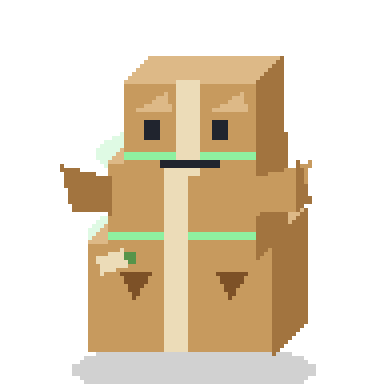
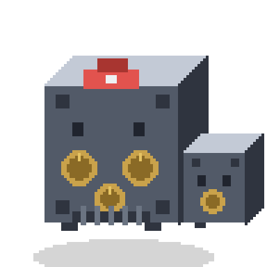
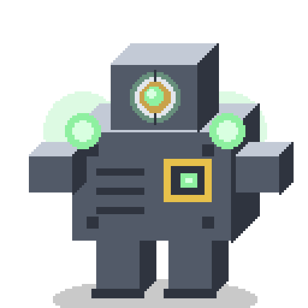

# Gegner-Katalog (Parodie-Monster)

**Status:** 10 einfache Monster beschrieben (englischbasierte Namen für internationale Lesbarkeit); Visuals folgen später (über `assets/generate_characters.py` im Pixel-Stil, s. `charaktere-visuals.md`).
**Rahmen:** ergänzt `gegner-encounter.md` (Archetypen §5) und `../03_Konzept_Gerüst.md` §4.
**Prüfinstanz:** `../02_Leitfaden_Kernmechaniken.md`.

## Schnittstellen zu anderen Systemen

- **Gegner-Design** (`gegner-encounter.md`): diese Monster instanziieren die Archetypen und erweitern sie um vier Mechaniken (Split, MP-Drain+Flucht, Untot, Physisch-Immun).
- **Kampf/Stats** (`kampf-analyse-shock.md`, `stats-kampfwerte.md`): Merkmale hängen an Schwäche-Tags, DEF/SPD, MAG-Immunität, telegrafierten Aktionen.
- **Materia** (`materia.md`): mehrere Monster lehren gezielt Materia-Nutzung (Element, Alle, Heilung offensiv, Magie gegen Physisch-Immun).
- **Visuals** (`charaktere-visuals.md`): Sprites im selben 64×64-Iso-Pixel-Stil.

## Grundprinzip

Jedes Monster ist bewusst **einfach** und trägt **ein** klar lesbares kampfrelevantes Merkmal (auch „keine Merkmale" ist eines). Die Visual-Beschreibung nennt Silhouette + einen sichtbaren Hinweis auf das Merkmal (Telegraf, Struktur, Durchsichtigkeit …). Namen sind englischbasiert, damit sie international verständlich bleiben.

## Die 10 Monster

| # | Name | Vorbild (FF7) | Kampf-Merkmal · Archetyp | Visualisierung |
|---|------|---------------|--------------------------|----------------|
| 1 | **Blando** | Guard Hound | **Keine Merkmale** – Baseline für den Kern-Loop · Standard | Schlichter brauner Pappkarton (Umzugskarton-Beige mit dunkleren Kanten), ein heller Klebeband-Streifen quer über die Oberkante, zwei Punktaugen + gerader Strichmund. Ausdruckslos und bewusst schmucklos (Blando = „bland"). |
| 2 | **Kindlebale** | Hedgehog Pie | **Feuer-Schwäche** → schneller Shock · Schwäche-Gegner | Runder Strohballen (gelb-braun, Halm-Textur), Punktaugen, abstehende Halme signalisieren „brennbar". |
| 3 | **Safeguard** | Sahagin / Heavy Tank | **Sehr hohe DEF**, physisch prallt ab; Schwäche/Magie nötig · Panzer | Kleiner Metall-Tresor mit Zahlenrad, Stummelfüßen, grimmiger Klappe als Mund, Nietenplatten. |
| 4 | **Caffiend** | Mu | **Sehr hoher SPD**, handelt ständig; Suppression glänzt · Flitzer | Zappelnder To-Go-Kaffeebecher, weit aufgerissene Augen, Zitter-/Speedlines, Dampf. |
| 5 | **Shortfuse** | Bomb (Self-Destruct) | **Telegrafierte Selbstzerstörung** (AoE), stirbt dabei; feuer-immun · Nuker | Runde rote Bombe mit funkender Zündschnur, wird sichtbar größer/glühender je näher der Knall. |
| 6 | **Mitoslime** | Grangalan | **Teilt sich** bei Treffer/Tod in kleinere Kopien; belohnt AoE/Fokus · (neu: Split) | Grün-glibbriger Tropfen mit Teilungsfurche und kleinem abknospendem „Kind"-Knubbel. |
| 7 | **Pilferret** | Vice | **Saugt MP** ab und **flieht** (schnell); schneller Kill/Suppress nötig · (neu: Drain+Flucht) | Schlankes maskiertes Wiesel/Frettchen mit Räubermaske, hält ein glühendes MP-Kügelchen. |
| 8 | **Boolinen** | Untote (Restorative-Schwäche) | **Untot**: Heilung schadet ihm (Heil-Materia offensiv!), saugt selbst HP · (neu: Untot/Sustain) | Weißes Bettlaken-Gespenst, dunkle Augenlöcher, schwebt leicht durchscheinend über dem Boden. |
| 9 | **Funkus** | Grashtrike / Zenene | **Vergiftet** (Schaden über Zeit), zwingt zu Defensive · Status-Gegner | Dicker mürrischer Pilz mit giftgrüner Sporen-Gaswolke über dem Hut. |
| 10 | **Jellyphase** | Ghost / fliegende Gegner | **Physisch immun**, nur Magie/MAG wirkt; erzwingt Build-Flexibilität · (neu: Physisch-Immun) | Durchscheinende bläulich-wabbelige Schwebequalle, baumelnde Tentakel; ATK „phast" sichtbar hindurch. |

## Debüt: Zyklus 1 (bis 1. Reunion) vs. Kapitel 2+

Vor der 1. Reunion gibt es noch keine Materia/Elemente/Magie. **Shock baut sich auf neutralen Gegnern trotzdem auf** (nur langsamer, s. `kampf-analyse-shock.md` §6), daher funktioniert der frühe Kampf.

- **Zyklus 1:** Blando, Caffiend, Pilferret, Shortfuse, Funkus, Safeguard (als zäher Gegner; volle Schwäche-Pointe erst Kap. 2). **Kindlebale als Teaser** in Region 2 (Schwäche sichtbar, Auszahlung mit Feuer-Materia in Kap. 2).
- **Kapitel 2+** (brauchen Materia/Elemente/Magie/„Alle"): **Jellyphase** (physisch immun → ohne Magie unschaffbar), **Boolinen** (Heilung-als-Schaden braucht zielbare Heil-Materia), **Mitoslime** (Split-Pointe zündet mit „Alle").

## Lehr-Rollout (Vorschlag, an Regionen koppelbar)

Blando (Basis) → Kindlebale (Element/Shock-Teaser) → Caffiend (Suppress) + Safeguard (DEF/Schwäche) → Shortfuse (Telegraf/Defense) → Mitoslime (AoE) → Funkus (Status) → Pilferret (Ressourcen-Druck) → Jellyphase (Magie erzwungen) → Boolinen (Heilung offensiv). Genaue Zuordnung zu Zonen/Regionen: später in `progression-regionen.md`.

## Bosse & Gates (Kapitel 1)

Die drei Kapitel-1-Gates sind **aufgemotzte Varianten bestehender Monster-Familien** – so bleibt die visuelle Herkunft lesbar und es braucht keine neuen Grund-Assets. Sie werden **größer dargestellt** (Minibosse 1,5× = 96px, Kapitel-Boss 2× = 128px) und dürfen die Stage sichtbar dominieren. Namen sind englische Eigennamen mit Parodie-Wortspiel (F2-USP). Iso-Stil, Palette und Bodenschatten identisch zu den Standard-Monstern (`charaktere-visuals.md`). Stats/Rolle: `encounter-zyklus1.md`.

| Boss | Vorbild (FF7) | Basis-Familie | Rolle · Merkmal | Größe |
|------|---------------|---------------|-----------------|:---:|
| **Blandzilla** | Guard Scorpion (erster Boss / Limit-Moment) | Blando (Karton) | Miniboss R1 – lehrt das **Limit** als Wand-Brecher; telegrafiert durch „Atmen" | 1,5× |
| **Fort Knoxious** | zäher Wächter am Wall-Market-Ausgang | Safeguard (Tresor) | R2-Gate – **hohe DEF**, Panzer-Duo; „hier will ich später Schwäche/Magie" | 1,5× |
| **Vaultron** | Konzern-Mecha beim Turm-Finale (Shinra-HQ) | Safeguard (Tresor) | Kapitel-Boss – **telegrafierte Groß-Attacke** (Mako-Kern lädt sichtbar) | 2× |

Größenvergleich (maßstabsgetreu, Minibosse 1,5× / Kapitel-Boss 2×):

**Blandzilla** *(bland + Godzilla).* Kaiju-Eskalation des langweiligsten Gegners: ein **wackelig gestapelter Turm aus mehreren Umzugskartons**, leicht schief – die vertikale Kaiju-Silhouette entsteht rein aus der Stapelung. Der oberste, größte Karton trägt das vergrößerte Blando-Gesicht (Punktaugen, Strichmund), jetzt grimmig mit **hochgeknickten Kartonlaschen als Augenbrauen**. Der Klebeband-Streifen kehrt als **kreuz und quer um den Turm gewickeltes Packband** wieder (hält den Stapel notdürftig zusammen). Aus den Ritzen quillt **grün glühendes Mako-Füllmaterial** (Reactor-Row-Bezug); seitlich aufgerissene Laschen als grobe „Arme". Merkmal-Telegraf: der Turm **schwankt/atmet** sichtbar (Aufladen), kurz vor der eigenen Attacke wird das Mako-Leuchten greller → das Limit-Fenster. Parodie-Detail: ein „↑↑ THIS SIDE UP"-Aufdruck, den er kopfüber trägt.

**Fort Knoxious** *(Fort Knox + obnoxious).* Ein unverschämt zäher Geldschrank: breiter und höher als Safeguard, mit **doppelt dicken Nietenplatten** und gleich **mehreren messingfarbenen Zahlenrädern** (Kombinationsschloss) statt einem. Die grimmige Tresorklappe wird zu einem **massiven, vergitterten Maul**. Als Duo begleitet ihn ein kleinerer, flinkerer **Beitresor** (Vater/Sohn-Gag). Merkmal-Hinweis „hohe DEF": ein rotes, blinkendes **„LOCKED"-Schild** – signalisiert, dass hier später Schwäche/Magie den Panzer knackt (in Kap. 1 ist Shock der Konter).

**Vaultron** *(Vault + Voltron).* Der ultimative Firmen-Tresor, zum Kampf-Mecha zusammengefaltet: mehrere Tresor-Segmente zu einer **aufrechten Mecha-Silhouette** gestapelt – Kopf = Tresortür mit leuchtendem Zahlenrad als Zyklopen-Auge, Rumpf = wuchtiger Panzerschrank auf stämmigen Metallbeinen. Konzern-Details: eine **MegaCorp-Prägung** auf der Brust und Geldschein-Einwurfschlitze. Merkmal-Telegraf für die AoE: an den Schultern lädt sich ein **glühender Mako-Kern** sichtbar auf und wird kurz vor der Über-Attacke greller → das Fenster zum Verteidigen/Heilen/Limit.

## Offene Punkte (später)

- Zuordnung der Monster zu Regionen/Zonen und Stat-Skalierung.
- Feinschliff der Flavor-Texte.
- Ob Fort Knoxious' Beitresor ein eigenes Add mit eigenen Stats wird oder rein visuell bleibt.

## Sprites

Alle 10 als Pixel-Sprites vorhanden: `assets/monsters/` (64/256 + Kontaktbogen), reproduzierbar über `assets/generate_monsters.py`. Stil-Regeln: `charaktere-visuals.md`.
